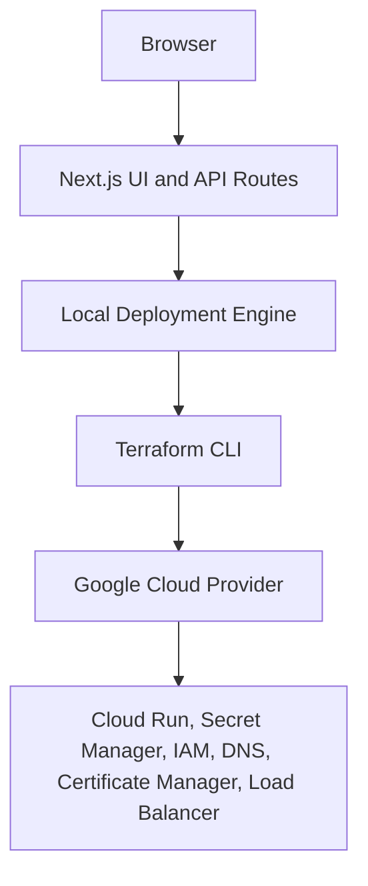

# gtm-server-deployer

Open-source, local-first web application for deploying Google Tag Manager Server-Side tagging infrastructure with Terraform.

This repository is a portfolio-grade control plane for a single-machine workflow: run a Next.js app locally, review Terraform changes before apply, and provision the GCP MVP without turning the project into a hosted SaaS.

## One-click Deployment

### Deploy to Google Cloud

The MVP runs locally: install the requirements, start the Next.js app, complete the Deploy Wizard, review the Terraform plan, and confirm apply. A Google Cloud Shell launch button is on the roadmap.

### Deploy to Azure

Azure deployment is on the roadmap. The intended entry point will use an Azure bootstrap backed by the Azure Terraform module.

### Deploy to AWS

AWS deployment is on the roadmap. The intended entry point will use an AWS bootstrap backed by the AWS Terraform module.

### Deploy to Any Terraform-supported Cloud

Generic Terraform export is on the roadmap. The intended flow will provide a provider-neutral template and instructions for supplying provider configuration and variables.

## Features

- Local Next.js deployment control plane
- GCP Terraform module
- Cloud Run GTM Server Container
- Optional Preview Server
- Secret Manager for GTM container config
- Terraform init, plan, apply, output, and destroy from the UI
- Live deployment logs
- Managed HTTPS through Cloud Run URLs by default
- Optional custom domain path with HTTPS load balancing, Certificate Manager, and Cloud DNS
- Local tool path overrides for Terraform, `gcloud`, and Docker

## Architecture



## Tech Stack

### Frontend

- Next.js App Router
- TypeScript
- TailwindCSS
- shadcn-style UI components
- React Hook Form
- Zod

### Backend

- Next.js route handlers
- Node.js child processes for Terraform orchestration
- Local filesystem state in `.gtm-server-deployer/`

### Infrastructure

- Terraform `>= 1.6.0`
- Google Cloud provider `>= 5.30.0`
- Google Cloud Run
- Secret Manager
- Certificate Manager
- Cloud DNS
- Docker-compatible GTM server container

## Requirements

- Node.js
- Terraform `>= 1.6.0`
- Google Cloud CLI (`gcloud`)
- Authenticated `gcloud` account with permissions for Cloud Run, Secret Manager, IAM, Compute, Certificate Manager, and Cloud DNS
- Docker CLI for the configurable local toolchain surface in Settings
- AWS CLI and Azure CLI are optional for future provider work

## Installation

```bash
git clone https://github.com/otyeung/gtm-server-deployer.git
cd gtm-server-deployer
npm install
npm run dev
```

Open `http://localhost:3000`.

## Usage

1. Open the Deploy Wizard.
2. Keep Google Cloud selected as the active MVP provider.
3. Enter the GCP project ID, region, environment, GTM container config, and scaling settings.
4. Optionally enable the Preview Server and custom domain / Cloud DNS settings.
5. Click **Review and Plan**.
6. Inspect the generated summary and Terraform plan result.
7. Click **Confirm Apply**.
8. Open **Status** to review live logs and Terraform outputs.

## Destroy Infrastructure

Open **Status**, confirm the destroy warning, and click **Destroy**. The app runs `terraform destroy` from the local workspace and clears the active deployment metadata after a successful teardown.

## Screenshots

Screenshots will be added after the first UI implementation pass.

## Roadmap

- Multi-region deployment
- Google Cloud Shell launch button
- GitHub Actions CI/CD
- Drift detection
- Cost estimation
- AI deployment assistant
- Auto-scaling recommendations
- Infrastructure visualization
- Policy validation
- Secret rotation
- Working AWS deployment
- Working Azure deployment
- Generic Terraform template export

## Contributing

Issues and pull requests are welcome. Keep changes focused, typed, tested, and aligned with the local-first scope.

## License

Apache License 2.0. See [LICENSE](./LICENSE).
