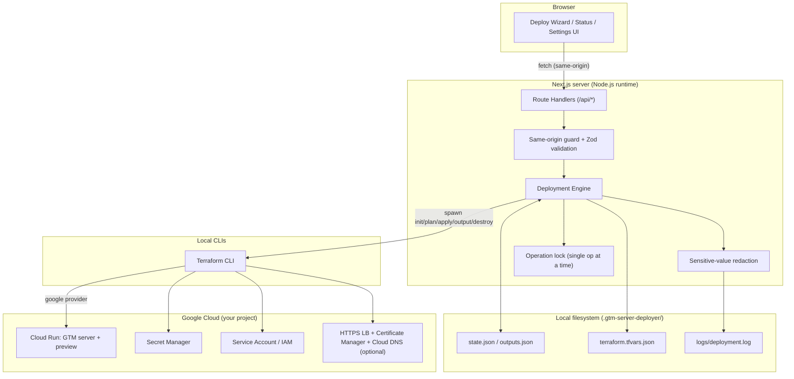
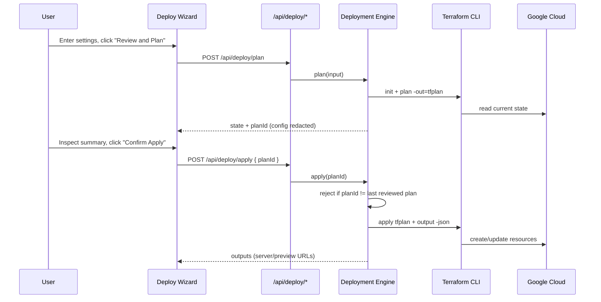

# gtm-server-deployer

Open-source, local-first web application for deploying Google Tag Manager Server-Side tagging infrastructure with Terraform.

This repository is a portfolio-grade control plane for a single-machine workflow: run a Next.js app locally, review Terraform changes before apply, and provision the GCP MVP without turning the project into a hosted SaaS.

## Executive Summary

**The problem.** Server-side Google Tag Manager (sGTM) has become the standard way to move tag processing off the browser: it strengthens first-party data collection, resists ad blockers and cookie/ITP restrictions, centralizes consent and data governance, and reduces client-side load. But standing up a _production-grade_ sGTM server on Google Cloud is operationally heavy. You must enable several GCP APIs, create service accounts and IAM bindings, store the container configuration as a secret, deploy the tagging and preview containers on Cloud Run, and — for a branded first-party endpoint — provision an HTTPS load balancer, managed TLS certificates, and DNS. Doing this by hand in the Console or with ad-hoc `gcloud` commands is error-prone, hard to reproduce across environments, and easy to leave half-configured or difficult to tear down cleanly. The usual escape hatch is a paid third-party hosting vendor, which adds recurring cost and routes your first-party data through someone else's infrastructure.

**The solution.** `gtm-server-deployer` is a local-first control plane that turns that manual, multi-service setup into a guided, reproducible, review-before-apply workflow on **your own** GCP project:

- A **Deploy Wizard** collects project, region, scaling, container config, and optional custom-domain settings with strict validation.
- Every deployment produces a **Terraform plan you review before anything changes**, and apply is bound to the exact plan you approved.
- The app **streams live Terraform logs**, surfaces **outputs** (Cloud Run server/preview URLs), and provides **one-click destroy**.
- Managed **HTTPS is on by default** via Cloud Run URLs, with an optional custom-domain path (HTTPS load balancer + Certificate Manager + Cloud DNS).

The result: you keep full ownership of the infrastructure and data, get versioned Infrastructure-as-Code instead of console clicks, and avoid recurring SaaS fees — all driven from a single machine with no hosted backend.

## One-click Deployment

### Deploy to Google Cloud

The MVP runs locally: install the requirements, start the Next.js app, complete the Deploy Wizard, review the Terraform plan, and confirm apply. A Google Cloud Shell launch button is on the roadmap.

### Deploy to Azure

Azure deployment is on the roadmap. The intended entry point will use an Azure bootstrap backed by the Azure Terraform module.

### Deploy to AWS

AWS deployment is on the roadmap. The intended entry point will use an AWS bootstrap backed by the AWS Terraform module.

### Deploy to Any Terraform-supported Cloud

Generic Terraform export is on the roadmap. The intended flow will provide a provider-neutral template and instructions for supplying provider configuration and variables.

## Features

- Local Next.js deployment control plane
- GCP Terraform module
- Cloud Run GTM Server Container
- Optional Preview Server
- Secret Manager for GTM container config
- Terraform init, plan, apply, output, and destroy from the UI
- Live deployment logs
- Managed HTTPS through Cloud Run URLs by default
- Optional custom domain path with HTTPS load balancing, Certificate Manager, and Cloud DNS
- Plan review with apply bound to the exact approved plan (`planId`)
- Same-origin API protection and single-operation locking
- Sensitive GTM container config redacted from logs
- Local tool path overrides for Terraform, `gcloud`, and Docker

## Tech Stack & System Architecture

### System architecture

The app is a single-process Next.js control plane. The browser talks only to same-origin API routes; a server-side **Deployment Engine** is the only component that shells out to the Terraform CLI, which in turn talks to Google Cloud. All state lives on the local filesystem — there is no external database or hosted backend.



### Deploy sequence



### Stack

**Frontend**

- Next.js 16 (App Router) with React 19
- TypeScript
- Tailwind CSS v4 (`@tailwindcss/postcss`)
- shadcn-style UI primitives built with `class-variance-authority`, `clsx`, `tailwind-merge`, and `lucide-react` icons
- `react-hook-form` + `@hookform/resolvers` with Zod schemas

**Backend (in-process)**

- Next.js Route Handlers (`runtime = "nodejs"`)
- Deployment Engine that orchestrates the Terraform CLI via `node:child_process` (`spawn`)
- Same-origin request validation on every mutating route (Origin/Referer checks)
- Sensitive-value redaction before anything is written to logs
- A filesystem operation lock so only one plan/apply/destroy runs at a time
- Local JSON state in `.gtm-server-deployer/` — no database, `server-only`-guarded modules

**Infrastructure (`terraform/gcp`)**

- Terraform `>= 1.6.0`, Google provider `>= 5.30.0`
- Project API enablement (`google_project_service`) scoped to the minimum set for the default Cloud Run path
- Dedicated service account + IAM bindings
- Secret Manager secret + version for the GTM container config
- Cloud Run v2 services: GTM tagging server and optional preview server (default image `gcr.io/cloud-tagging-10302018/gtm-cloud-image:stable`)
- Optional custom-domain path: global address + HTTPS load balancer, Certificate Manager managed certificate, and Cloud DNS managed zone/records
- Native Terraform tests (`*.tftest.hcl`) for service scoping and custom-domain logic

**Quality tooling**

- Vitest + Testing Library (`jsdom`) for unit, component, and API tests
- ESLint (`eslint-config-next`) and Prettier

## Requirements

- Node.js `>= 20`
- Terraform `>= 1.6.0`
- Google Cloud CLI (`gcloud`)
- Authenticated `gcloud` account with permissions for Cloud Run, Secret Manager, IAM, Compute, Certificate Manager, and Cloud DNS
- Docker CLI for the configurable local toolchain surface in Settings
- AWS CLI and Azure CLI are optional for future provider work

## Installation

```bash
git clone https://github.com/otyeung/gtm-server-deployer.git
cd gtm-server-deployer
npm install
npm run dev
```

Open `http://localhost:3000`.

## Usage

1. Open the Deploy Wizard.
2. Keep Google Cloud selected as the active MVP provider.
3. Enter the GCP project ID, region, environment, GTM container config, and scaling settings.
4. Optionally enable the Preview Server and custom domain / Cloud DNS settings.
5. Click **Review and Plan**.
6. Inspect the generated summary and Terraform plan result.
7. Click **Confirm Apply**.
8. Open **Status** to review live logs and Terraform outputs.

## API Reference

All routes are same-origin only; mutating routes reject cross-origin requests and validate payloads with Zod.

| Method & path            | Purpose                                                                                 |
| ------------------------ | --------------------------------------------------------------------------------------- |
| `POST /api/deploy/plan`  | Validate inputs, run `terraform init` + `plan`, return deployment state and a `planId`. |
| `POST /api/deploy/apply` | Apply the previously reviewed plan; requires the matching `planId`.                     |
| `POST /api/destroy`      | Run `terraform destroy` and clear active deployment metadata.                           |
| `GET /api/status`        | Current deployment phase, active operation, and last error.                             |
| `GET /api/logs`          | Latest Terraform log output (sensitive values redacted).                                |
| `GET /api/output`        | Terraform outputs (server/preview URLs, region, custom-domain details).                 |
| `GET /api/settings`      | Read local tool paths (Terraform, `gcloud`, Docker).                                    |
| `POST /api/settings`     | Persist local tool paths.                                                               |

## Local Workspace & State

State is kept on the local filesystem under `.gtm-server-deployer/` (gitignored) — there is no external datastore:

- `state.json` — deployment phase, active operation, and last successful `planId`
- `settings.json` — local Terraform / `gcloud` / Docker binary paths
- `terraform.tfvars.json` — generated Terraform variables for the current deployment
- `outputs.json` — Terraform outputs captured after a successful apply
- `logs/deployment.log` — streamed Terraform logs with sensitive values redacted
- `operation.lock` — guards against concurrent plan/apply/destroy runs
- `workdir/gcp/` — copy of the GCP Terraform module used for the run

## Destroy Infrastructure

Open **Status**, confirm the destroy warning, and click **Destroy**. The app runs `terraform destroy` from the local workspace and clears the active deployment metadata after a successful teardown.

## Screenshots

Screenshots will be added after the first UI implementation pass.

## Roadmap

- Multi-region deployment
- Google Cloud Shell launch button
- GitHub Actions CI/CD
- Drift detection
- Cost estimation
- AI deployment assistant
- Auto-scaling recommendations
- Infrastructure visualization
- Policy validation
- Secret rotation
- Working AWS deployment
- Working Azure deployment
- Generic Terraform template export

## Contributing

Issues and pull requests are welcome. Keep changes focused, typed, tested, and aligned with the local-first scope.

## License

Apache License 2.0. See [LICENSE](./LICENSE).
