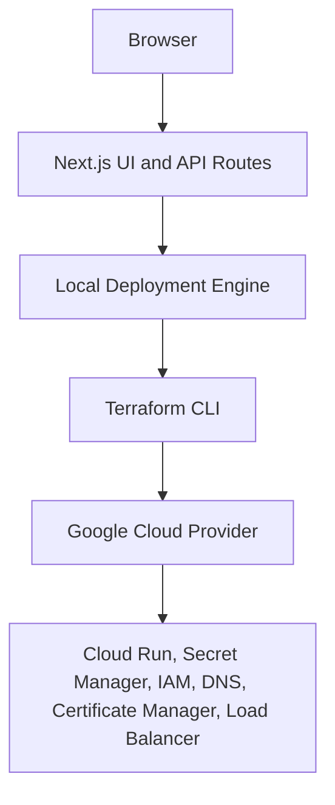

# gtm-server-deployer GCP MVP Implementation Plan

> **For agentic workers:** REQUIRED SUB-SKILL: Use superpowers:subagent-driven-development (recommended) or superpowers:executing-plans to implement this plan task-by-task. Steps use checkbox (`- [ ]`) syntax for tracking.

**Goal:** Build a local-first Next.js application that plans, applies, monitors, and destroys a Google Tag Manager Server-Side GCP deployment through Terraform.

**Architecture:** The app is a single Next.js App Router project with route handlers running in the Node.js runtime. Client pages use React Hook Form and Zod for the deployment wizard, while server-only TypeScript modules own local workspace files, Terraform command execution, state transitions, log redaction, and output parsing. Terraform code lives under `terraform/gcp`, with AWS, Azure, and generic provider directories documented as future provider surfaces.

**Tech Stack:** Next.js App Router, TypeScript strict mode, TailwindCSS, shadcn-style reusable components, React Hook Form, Zod, Vitest, Terraform Google provider, Google Cloud Run, Secret Manager, Certificate Manager, Cloud DNS, Docker, local `gcloud`, local Terraform.

## Global Constraints

- Use TypeScript strict mode.
- Use ESLint and Prettier.
- Use modular architecture and reusable React components.
- Use strong typing and environment variable or settings validation.
- Use production-ready, actionable error reporting.
- Keep the UI mobile responsive.
- Do not add authentication, multi-user support, billing, SaaS backend behavior, or a database.
- Support one active local deployment at a time.
- Store generated runtime artifacts under `.gtm-server-deployer/` and ignore that directory in git.
- Treat the GTM container config as sensitive and redact it from logs, API responses, and UI summaries.
- Run `terraform plan` before `terraform apply`; require a Confirm Apply action before applying.
- Implement GCP deployment in this MVP; keep AWS, Azure, and generic Terraform as documented future provider surfaces.
- Use Cloud Run HTTPS URLs by default; configure load balancer, Certificate Manager, and Cloud DNS only when a custom domain is provided.
- Include the Apache 2.0 license notice in README documentation.

---

## Scope Check

The approved design is focused enough for one implementation plan: a GCP-only local MVP. AWS, Azure, and generic Terraform remain documented future surfaces and are not executable deployment paths in this plan.

## File Structure Map

### Project scaffolding

- `package.json`: npm scripts and dependencies.
- `tsconfig.json`: strict TypeScript and `@/*` path alias.
- `next.config.ts`: Next.js configuration.
- `eslint.config.mjs`: ESLint configuration for Next.js and TypeScript.
- `prettier.config.mjs`: formatting rules.
- `postcss.config.mjs`: TailwindCSS PostCSS integration.
- `vitest.config.ts`: Vitest aliases and jsdom environment.
- `tests/setup.ts`: Testing Library setup.
- `.gitignore`: ignores dependencies, Next.js build output, local env files, and `.gtm-server-deployer/`.

### App routes and pages

- `app/layout.tsx`: root HTML shell and metadata.
- `app/globals.css`: Tailwind import, CSS variables, and base styles.
- `app/page.tsx`: landing page.
- `app/deploy/page.tsx`: deployment wizard page.
- `app/status/page.tsx`: status, logs, outputs, and destroy page.
- `app/settings/page.tsx`: local binary path settings page.
- `app/api/deploy/plan/route.ts`: validates input and runs init/plan.
- `app/api/deploy/apply/route.ts`: applies the latest successful plan.
- `app/api/destroy/route.ts`: destroys the active deployment.
- `app/api/status/route.ts`: returns deployment state.
- `app/api/logs/route.ts`: returns redacted logs.
- `app/api/output/route.ts`: returns Terraform outputs.
- `app/api/settings/route.ts`: reads and writes local settings.

### Shared application code

- `lib/schemas/deployment.ts`: Zod schema and inferred types for deployment input.
- `lib/schemas/settings.ts`: Zod schema and inferred types for local settings.
- `lib/deployment/types.ts`: deployment state, output, error, and operation types.
- `lib/deployment/redaction.ts`: sensitive value redaction helpers.
- `lib/deployment/paths.ts`: workspace path construction.
- `lib/deployment/workspace.ts`: local file read/write helpers.
- `lib/deployment/errors.ts`: normalized application error helpers.
- `lib/deployment/engine.ts`: deployment state machine and Terraform orchestration.
- `lib/deployment/engine-instance.ts`: singleton factory used by route handlers.
- `lib/terraform/runner.ts`: child-process wrapper for Terraform commands.
- `lib/utils.ts`: class name helper for UI components.

### Components

- `components/layout/navbar.tsx`: navigation.
- `components/home/provider-card.tsx`: provider availability card.
- `components/deploy/deploy-wizard.tsx`: multi-step deployment form.
- `components/deploy/review-summary.tsx`: redacted deployment review.
- `components/status/status-dashboard.tsx`: status page client component.
- `components/status/terraform-console.tsx`: log console.
- `components/status/outputs-card.tsx`: Terraform outputs display.
- `components/status/destroy-dialog.tsx`: guarded destroy confirmation.
- `components/settings/settings-form.tsx`: local binary path settings form.
- `components/ui/button.tsx`, `card.tsx`, `input.tsx`, `label.tsx`, `textarea.tsx`, `checkbox.tsx`, `select.tsx`, `badge.tsx`, `dialog.tsx`: shadcn-style primitives.

### Terraform

- `terraform/gcp/versions.tf`: Terraform and Google provider requirements.
- `terraform/gcp/variables.tf`: input variables with validation.
- `terraform/gcp/main.tf`: GCP APIs, Secret Manager, IAM, Cloud Run, optional HTTPS load balancer, optional DNS.
- `terraform/gcp/outputs.tf`: URLs, service names, region, load balancer IP, and certificate outputs.
- `terraform/gcp/README.md`: GCP module usage and variables.
- `terraform/aws/README.md`, `terraform/azure/README.md`, `terraform/generic/README.md`: future provider documentation.

---

### Task 1: Project Scaffold and Test Harness

**Files:**
- Create: `package.json`
- Create: `tsconfig.json`
- Create: `next.config.ts`
- Create: `eslint.config.mjs`
- Create: `prettier.config.mjs`
- Create: `postcss.config.mjs`
- Create: `vitest.config.ts`
- Create: `tests/setup.ts`
- Modify: `.gitignore`
- Create: `app/layout.tsx`
- Create: `app/globals.css`
- Create: `app/page.tsx`
- Create: `components/layout/navbar.tsx`
- Create: `lib/utils.ts`
- Test: `tests/app/home.test.tsx`

**Interfaces:**
- Produces: npm scripts `dev`, `build`, `start`, `lint`, `test`, `test:watch`, `format`, `format:check`.
- Produces: path alias `@/*` for imports from the repository root.
- Produces: `cn(...inputs: ClassValue[]): string` from `lib/utils.ts`.
- Produces: a rendered home page with text `Deploy GTM Server-Side tagging infrastructure from your machine`.

- [ ] **Step 1: Create package and tool configuration**

Create `package.json`:

```json
{
  "name": "gtm-server-deployer",
  "version": "0.1.0",
  "private": false,
  "license": "Apache-2.0",
  "scripts": {
    "dev": "next dev",
    "build": "next build",
    "start": "next start",
    "lint": "next lint",
    "test": "vitest run",
    "test:watch": "vitest",
    "format": "prettier --write .",
    "format:check": "prettier --check ."
  },
  "dependencies": {
    "@hookform/resolvers": "latest",
    "class-variance-authority": "latest",
    "clsx": "latest",
    "lucide-react": "latest",
    "next": "latest",
    "react": "latest",
    "react-dom": "latest",
    "react-hook-form": "latest",
    "server-only": "latest",
    "tailwind-merge": "latest",
    "zod": "latest"
  },
  "devDependencies": {
    "@tailwindcss/postcss": "latest",
    "@testing-library/jest-dom": "latest",
    "@testing-library/react": "latest",
    "@testing-library/user-event": "latest",
    "@types/node": "latest",
    "@types/react": "latest",
    "@types/react-dom": "latest",
    "eslint": "latest",
    "eslint-config-next": "latest",
    "jsdom": "latest",
    "postcss": "latest",
    "prettier": "latest",
    "tailwindcss": "latest",
    "typescript": "latest",
    "vitest": "latest"
  }
}
```

Create `tsconfig.json`:

```json
{
  "compilerOptions": {
    "target": "ES2022",
    "lib": ["dom", "dom.iterable", "es2022"],
    "allowJs": false,
    "skipLibCheck": true,
    "strict": true,
    "noEmit": true,
    "esModuleInterop": true,
    "module": "esnext",
    "moduleResolution": "bundler",
    "resolveJsonModule": true,
    "isolatedModules": true,
    "jsx": "preserve",
    "incremental": true,
    "plugins": [{ "name": "next" }],
    "paths": {
      "@/*": ["./*"]
    }
  },
  "include": ["next-env.d.ts", "**/*.ts", "**/*.tsx", ".next/types/**/*.ts"],
  "exclude": ["node_modules"]
}
```

Create `next.config.ts`:

```ts
import type { NextConfig } from "next";

const nextConfig: NextConfig = {};

export default nextConfig;
```

Create `eslint.config.mjs`:

```js
import next from "eslint-config-next";

export default [...next];
```

Create `prettier.config.mjs`:

```js
/** @type {import("prettier").Config} */
const config = {
  semi: true,
  trailingComma: "all",
  singleQuote: false,
  printWidth: 100
};

export default config;
```

Create `postcss.config.mjs`:

```js
const config = {
  plugins: {
    "@tailwindcss/postcss": {}
  }
};

export default config;
```

Create `vitest.config.ts`:

```ts
import path from "node:path";
import { defineConfig } from "vitest/config";

export default defineConfig({
  test: {
    environment: "jsdom",
    globals: true,
    setupFiles: ["./tests/setup.ts"]
  },
  resolve: {
    alias: {
      "@": path.resolve(__dirname, ".")
    }
  }
});
```

Create `tests/setup.ts`:

```ts
import "@testing-library/jest-dom/vitest";
```

Create `.gitignore`:

```gitignore
.worktrees/
node_modules/
.next/
out/
coverage/
.env
.env.*
!.env.example
.DS_Store
.gtm-server-deployer/
*.tfstate
*.tfstate.*
.terraform/
.terraform.lock.hcl
```

- [ ] **Step 2: Install dependencies**

Run:

```bash
npm install
```

Expected: `package-lock.json` is created and npm exits with code 0.

- [ ] **Step 3: Write the failing home page smoke test**

Create `tests/app/home.test.tsx`:

```tsx
import { render, screen } from "@testing-library/react";
import HomePage from "@/app/page";

describe("HomePage", () => {
  it("introduces the local GTM server deployment workflow", () => {
    render(<HomePage />);

    expect(
      screen.getByText("Deploy GTM Server-Side tagging infrastructure from your machine"),
    ).toBeInTheDocument();
    expect(screen.getByRole("link", { name: "Deploy to GCP" })).toHaveAttribute(
      "href",
      "/deploy",
    );
  });
});
```

- [ ] **Step 4: Run the smoke test to verify it fails**

Run:

```bash
npm test -- tests/app/home.test.tsx
```

Expected: FAIL because `@/app/page` does not exist.

- [ ] **Step 5: Create the app shell and home page**

Create `lib/utils.ts`:

```ts
import { clsx, type ClassValue } from "clsx";
import { twMerge } from "tailwind-merge";

export function cn(...inputs: ClassValue[]): string {
  return twMerge(clsx(inputs));
}
```

Create `app/globals.css`:

```css
@import "tailwindcss";

:root {
  --background: #f8fafc;
  --foreground: #0f172a;
  --muted: #e2e8f0;
  --primary: #2563eb;
  --primary-foreground: #ffffff;
}

body {
  margin: 0;
  background: var(--background);
  color: var(--foreground);
  font-family:
    Inter, ui-sans-serif, system-ui, -apple-system, BlinkMacSystemFont, "Segoe UI", sans-serif;
}
```

Create `app/layout.tsx`:

```tsx
import type { Metadata } from "next";
import Link from "next/link";
import "./globals.css";

export const metadata: Metadata = {
  title: "gtm-server-deployer",
  description: "Local-first GTM Server-Side tagging infrastructure deployment tool"
};

export default function RootLayout({ children }: Readonly<{ children: React.ReactNode }>) {
  return (
    <html lang="en">
      <body>
        <header className="border-b bg-white">
          <nav className="mx-auto flex max-w-6xl items-center justify-between px-4 py-4">
            <Link href="/" className="font-semibold tracking-tight">
              gtm-server-deployer
            </Link>
            <div className="flex gap-4 text-sm">
              <Link href="/deploy">Deploy</Link>
              <Link href="/status">Status</Link>
              <Link href="/settings">Settings</Link>
            </div>
          </nav>
        </header>
        {children}
      </body>
    </html>
  );
}
```

Create `components/layout/navbar.tsx`:

```tsx
import Link from "next/link";

export function Navbar() {
  return (
    <nav className="flex items-center justify-between">
      <Link href="/" className="font-semibold">
        gtm-server-deployer
      </Link>
      <div className="flex gap-4 text-sm">
        <Link href="/deploy">Deploy</Link>
        <Link href="/status">Status</Link>
        <Link href="/settings">Settings</Link>
      </div>
    </nav>
  );
}
```

Create `app/page.tsx`:

```tsx
import Link from "next/link";

const providers = [
  { name: "Google Cloud", status: "Available in MVP", href: "/deploy" },
  { name: "Azure", status: "Documented future provider", href: "#roadmap" },
  { name: "AWS", status: "Documented future provider", href: "#roadmap" },
  { name: "Generic Terraform", status: "Documented future provider", href: "#roadmap" }
];

export default function HomePage() {
  return (
    <main className="mx-auto flex max-w-6xl flex-col gap-12 px-4 py-16">
      <section className="grid gap-8 lg:grid-cols-[1.2fr_0.8fr] lg:items-center">
        <div className="space-y-6">
          <p className="text-sm font-medium uppercase tracking-[0.2em] text-blue-700">
            Local-first Terraform automation
          </p>
          <h1 className="max-w-3xl text-4xl font-bold tracking-tight sm:text-6xl">
            Deploy GTM Server-Side tagging infrastructure from your machine
          </h1>
          <p className="max-w-2xl text-lg text-slate-600">
            A portfolio-grade control plane for Google Tag Manager Server-Side deployments on
            Google Cloud Run, Secret Manager, and optional managed HTTPS infrastructure.
          </p>
          <div className="flex flex-wrap gap-3">
            <Link
              href="/deploy"
              className="rounded-full bg-blue-600 px-5 py-3 text-sm font-semibold text-white"
            >
              Deploy to GCP
            </Link>
            <Link
              href="https://github.com/otyeung/gtm-server-deployer"
              className="rounded-full border border-slate-300 px-5 py-3 text-sm font-semibold"
            >
              GitHub
            </Link>
          </div>
        </div>
        <div className="rounded-3xl border bg-white p-6 shadow-sm">
          <h2 className="text-lg font-semibold">Deployment flow</h2>
          <ol className="mt-4 space-y-3 text-sm text-slate-600">
            <li>1. Validate project and container settings</li>
            <li>2. Generate Terraform variables locally</li>
            <li>3. Run init and plan for review</li>
            <li>4. Confirm apply and inspect outputs</li>
          </ol>
        </div>
      </section>
      <section className="grid gap-4 md:grid-cols-2 lg:grid-cols-4">
        {providers.map((provider) => (
          <Link key={provider.name} href={provider.href} className="rounded-2xl border bg-white p-5">
            <h2 className="font-semibold">{provider.name}</h2>
            <p className="mt-2 text-sm text-slate-600">{provider.status}</p>
          </Link>
        ))}
      </section>
    </main>
  );
}
```

- [ ] **Step 6: Run scaffold checks**

Run:

```bash
npm test -- tests/app/home.test.tsx
npm run lint
npm run build
```

Expected: all commands exit with code 0.

- [ ] **Step 7: Commit**

```bash
git add .gitignore package.json package-lock.json tsconfig.json next.config.ts eslint.config.mjs prettier.config.mjs postcss.config.mjs vitest.config.ts tests/setup.ts tests/app/home.test.tsx app/layout.tsx app/globals.css app/page.tsx components/layout/navbar.tsx lib/utils.ts
git commit -m "chore(project): 建立 Next.js 專案骨架" -m "Co-authored-by: Copilot <223556219+Copilot@users.noreply.github.com>"
```

---

### Task 2: Deployment and Settings Schemas

**Files:**
- Create: `lib/schemas/deployment.ts`
- Create: `lib/schemas/settings.ts`
- Test: `tests/schemas/deployment.test.ts`
- Test: `tests/schemas/settings.test.ts`

**Interfaces:**
- Produces: `deploymentInputSchema`
- Produces: `type DeploymentInput = z.infer<typeof deploymentInputSchema>`
- Produces: `sanitizeDeploymentInputForReview(input: DeploymentInput): DeploymentReview`
- Produces: `settingsSchema`
- Produces: `type LocalSettings = z.infer<typeof settingsSchema>`
- Consumed by: deployment wizard, API route handlers, workspace writer, Terraform variable generator.

- [ ] **Step 1: Write failing deployment schema tests**

Create `tests/schemas/deployment.test.ts`:

```ts
import {
  deploymentInputSchema,
  sanitizeDeploymentInputForReview
} from "@/lib/schemas/deployment";

const validInput = {
  provider: "gcp",
  projectId: "gtm-server-deployer",
  region: "asia-southeast1",
  environment: "dev",
  containerImage: "gcr.io/cloud-tagging-10302018/gtm-cloud-image:stable",
  cpu: "1",
  memory: "512Mi",
  minInstances: 0,
  maxInstances: 3,
  gtmContainerConfig: "a-valid-container-config",
  enablePreviewServer: true,
  useHttps: true,
  useManagedSsl: true,
  customDomain: "",
  enableCloudDns: false
};

describe("deploymentInputSchema", () => {
  it("accepts the default GCP MVP deployment input", () => {
    const result = deploymentInputSchema.safeParse(validInput);

    expect(result.success).toBe(true);
  });

  it("rejects non-GCP providers for the MVP", () => {
    const result = deploymentInputSchema.safeParse({ ...validInput, provider: "aws" });

    expect(result.success).toBe(false);
  });

  it("requires a positive max instance count", () => {
    const result = deploymentInputSchema.safeParse({ ...validInput, maxInstances: 0 });

    expect(result.success).toBe(false);
  });

  it("redacts the GTM container config in review output", () => {
    const parsed = deploymentInputSchema.parse(validInput);

    expect(sanitizeDeploymentInputForReview(parsed).gtmContainerConfig).toBe("[REDACTED]");
  });
});
```

Create `tests/schemas/settings.test.ts`:

```ts
import { DEFAULT_LOCAL_SETTINGS, settingsSchema } from "@/lib/schemas/settings";

describe("settingsSchema", () => {
  it("uses PATH based defaults", () => {
    expect(settingsSchema.parse({})).toEqual(DEFAULT_LOCAL_SETTINGS);
  });

  it("accepts explicit binary paths", () => {
    expect(
      settingsSchema.parse({
        terraformPath: "/opt/bin/terraform",
        gcloudPath: "/opt/bin/gcloud",
        dockerPath: "/opt/bin/docker"
      }),
    ).toEqual({
      terraformPath: "/opt/bin/terraform",
      gcloudPath: "/opt/bin/gcloud",
      dockerPath: "/opt/bin/docker"
    });
  });
});
```

- [ ] **Step 2: Run tests to verify they fail**

Run:

```bash
npm test -- tests/schemas/deployment.test.ts tests/schemas/settings.test.ts
```

Expected: FAIL because the schema modules do not exist.

- [ ] **Step 3: Implement schemas**

Create `lib/schemas/deployment.ts`:

```ts
import { z } from "zod";

export const deploymentInputSchema = z
  .object({
    provider: z.literal("gcp"),
    projectId: z
      .string()
      .min(6, "Project ID must be at least 6 characters")
      .regex(/^[a-z][a-z0-9-]{4,28}[a-z0-9]$/, "Use a valid GCP project ID"),
    region: z.string().min(1).default("asia-southeast1"),
    environment: z.enum(["dev", "prod"]).default("dev"),
    containerImage: z.string().min(1).default("gcr.io/cloud-tagging-10302018/gtm-cloud-image:stable"),
    cpu: z.enum(["1", "2", "4"]).default("1"),
    memory: z.enum(["512Mi", "1Gi", "2Gi", "4Gi"]).default("512Mi"),
    minInstances: z.number().int().min(0).max(10).default(0),
    maxInstances: z.number().int().min(1).max(100).default(3),
    gtmContainerConfig: z.string().min(8, "Paste the GTM server container config"),
    enablePreviewServer: z.boolean().default(true),
    useHttps: z.boolean().default(true),
    useManagedSsl: z.boolean().default(true),
    customDomain: z
      .string()
      .trim()
      .regex(/^$|^([a-z0-9-]+\.)+[a-z]{2,}$/i, "Use a valid domain name")
      .default(""),
    enableCloudDns: z.boolean().default(false)
  })
  .refine((value) => value.maxInstances >= value.minInstances, {
    path: ["maxInstances"],
    message: "Max instances must be greater than or equal to min instances"
  })
  .refine((value) => !value.enableCloudDns || value.customDomain.length > 0, {
    path: ["enableCloudDns"],
    message: "Cloud DNS automation requires a custom domain"
  });

export type DeploymentInput = z.infer<typeof deploymentInputSchema>;

export type DeploymentReview = Omit<DeploymentInput, "gtmContainerConfig"> & {
  gtmContainerConfig: "[REDACTED]";
};

export function sanitizeDeploymentInputForReview(input: DeploymentInput): DeploymentReview {
  return {
    ...input,
    gtmContainerConfig: "[REDACTED]"
  };
}
```

Create `lib/schemas/settings.ts`:

```ts
import { z } from "zod";

export const DEFAULT_LOCAL_SETTINGS = {
  terraformPath: "terraform",
  gcloudPath: "gcloud",
  dockerPath: "docker"
} as const;

export const settingsSchema = z.object({
  terraformPath: z.string().min(1).default(DEFAULT_LOCAL_SETTINGS.terraformPath),
  gcloudPath: z.string().min(1).default(DEFAULT_LOCAL_SETTINGS.gcloudPath),
  dockerPath: z.string().min(1).default(DEFAULT_LOCAL_SETTINGS.dockerPath)
});

export type LocalSettings = z.infer<typeof settingsSchema>;
```

- [ ] **Step 4: Run schema tests**

Run:

```bash
npm test -- tests/schemas/deployment.test.ts tests/schemas/settings.test.ts
```

Expected: PASS.

- [ ] **Step 5: Commit**

```bash
git add lib/schemas/deployment.ts lib/schemas/settings.ts tests/schemas/deployment.test.ts tests/schemas/settings.test.ts
git commit -m "feat(schema): 新增部署設定驗證" -m "Co-authored-by: Copilot <223556219+Copilot@users.noreply.github.com>"
```

---

### Task 3: Local Workspace, State, and Redaction

**Files:**
- Create: `lib/deployment/types.ts`
- Create: `lib/deployment/redaction.ts`
- Create: `lib/deployment/paths.ts`
- Create: `lib/deployment/workspace.ts`
- Test: `tests/deployment/redaction.test.ts`
- Test: `tests/deployment/workspace.test.ts`

**Interfaces:**
- Consumes: `DeploymentInput` from `lib/schemas/deployment.ts`.
- Produces: `DeploymentPhase`, `DeploymentState`, `TerraformOutputMap`, `DeploymentLog`.
- Produces: `getWorkspacePaths(rootDir?: string): WorkspacePaths`.
- Produces: `ensureWorkspace(paths: WorkspacePaths): Promise<void>`.
- Produces: `writeDeploymentState(paths, state): Promise<void>`.
- Produces: `readDeploymentState(paths): Promise<DeploymentState>`.
- Produces: `appendDeploymentLog(paths, chunk): Promise<void>`.
- Produces: `readDeploymentLog(paths, sensitiveValues): Promise<string>`.
- Produces: `writeTerraformVars(paths, input): Promise<void>`.
- Produces: `redactSensitiveText(text, sensitiveValues): string`.

- [ ] **Step 1: Write failing redaction and workspace tests**

Create `tests/deployment/redaction.test.ts`:

```ts
import { redactSensitiveText } from "@/lib/deployment/redaction";

describe("redactSensitiveText", () => {
  it("replaces every sensitive value with a stable marker", () => {
    const result = redactSensitiveText("config=secret-value again secret-value", ["secret-value"]);

    expect(result).toBe("config=[REDACTED] again [REDACTED]");
  });

  it("ignores empty sensitive values", () => {
    expect(redactSensitiveText("safe", [""])).toBe("safe");
  });
});
```

Create `tests/deployment/workspace.test.ts`:

```ts
import { mkdtemp, readFile, rm } from "node:fs/promises";
import os from "node:os";
import path from "node:path";
import { afterEach, beforeEach, describe, expect, it } from "vitest";
import { getWorkspacePaths } from "@/lib/deployment/paths";
import {
  appendDeploymentLog,
  ensureWorkspace,
  readDeploymentLog,
  readDeploymentState,
  writeDeploymentState,
  writeTerraformVars
} from "@/lib/deployment/workspace";
import type { DeploymentState } from "@/lib/deployment/types";

let rootDir: string;

beforeEach(async () => {
  rootDir = await mkdtemp(path.join(os.tmpdir(), "gtm-server-deployer-"));
});

afterEach(async () => {
  await rm(rootDir, { force: true, recursive: true });
});

describe("workspace", () => {
  it("creates the expected workspace directories", async () => {
    const paths = getWorkspacePaths(rootDir);

    await ensureWorkspace(paths);

    await expect(readFile(paths.stateFile, "utf8")).rejects.toMatchObject({ code: "ENOENT" });
  });

  it("persists and reads deployment state", async () => {
    const paths = getWorkspacePaths(rootDir);
    const state: DeploymentState = {
      phase: "planned",
      activeOperation: null,
      projectId: "gtm-server-deployer",
      region: "asia-southeast1",
      startedAt: "2026-07-02T00:00:00.000Z",
      updatedAt: "2026-07-02T00:01:00.000Z",
      lastSuccessfulPlanAt: "2026-07-02T00:01:00.000Z",
      error: null
    };

    await ensureWorkspace(paths);
    await writeDeploymentState(paths, state);

    expect(await readDeploymentState(paths)).toEqual(state);
  });

  it("writes Terraform variables without returning secrets through logs", async () => {
    const paths = getWorkspacePaths(rootDir);
    await ensureWorkspace(paths);

    await writeTerraformVars(paths, {
      provider: "gcp",
      projectId: "gtm-server-deployer",
      region: "asia-southeast1",
      environment: "dev",
      containerImage: "gcr.io/cloud-tagging-10302018/gtm-cloud-image:stable",
      cpu: "1",
      memory: "512Mi",
      minInstances: 0,
      maxInstances: 3,
      gtmContainerConfig: "secret-config",
      enablePreviewServer: true,
      useHttps: true,
      useManagedSsl: true,
      customDomain: "",
      enableCloudDns: false
    });

    const tfvars = JSON.parse(await readFile(paths.tfvarsFile, "utf8"));
    expect(tfvars.gtm_container_config).toBe("secret-config");
  });

  it("redacts sensitive values when reading logs", async () => {
    const paths = getWorkspacePaths(rootDir);
    await ensureWorkspace(paths);

    await appendDeploymentLog(paths, "Applying with secret-config");

    expect(await readDeploymentLog(paths, ["secret-config"])).toContain("[REDACTED]");
  });
});
```

- [ ] **Step 2: Run tests to verify they fail**

Run:

```bash
npm test -- tests/deployment/redaction.test.ts tests/deployment/workspace.test.ts
```

Expected: FAIL because deployment workspace modules do not exist.

- [ ] **Step 3: Implement deployment types and workspace helpers**

Create `lib/deployment/types.ts`:

```ts
export type DeploymentPhase =
  | "idle"
  | "planning"
  | "planned"
  | "applying"
  | "applied"
  | "destroying"
  | "destroyed"
  | "failed";

export type DeploymentOperation = "plan" | "apply" | "destroy";

export type DeploymentError = {
  category:
    | "missing_binary"
    | "not_authenticated"
    | "invalid_input"
    | "permission_denied"
    | "quota_exceeded"
    | "terraform_failed"
    | "cloud_run_failed"
    | "dns_pending"
    | "certificate_pending"
    | "unknown";
  phase: DeploymentPhase;
  message: string;
  remediation: string;
  logExcerpt?: string;
};

export type DeploymentState = {
  phase: DeploymentPhase;
  activeOperation: DeploymentOperation | null;
  projectId: string | null;
  region: string | null;
  startedAt: string | null;
  updatedAt: string | null;
  lastSuccessfulPlanAt: string | null;
  error: DeploymentError | null;
};

export type TerraformOutputValue = {
  sensitive: boolean;
  type: unknown;
  value: unknown;
};

export type TerraformOutputMap = Record<string, TerraformOutputValue>;

export type WorkspacePaths = {
  rootDir: string;
  workspaceDir: string;
  logsDir: string;
  workdir: string;
  gcpWorkdir: string;
  stateFile: string;
  settingsFile: string;
  tfvarsFile: string;
  logFile: string;
  outputsFile: string;
};

export const EMPTY_DEPLOYMENT_STATE: DeploymentState = {
  phase: "idle",
  activeOperation: null,
  projectId: null,
  region: null,
  startedAt: null,
  updatedAt: null,
  lastSuccessfulPlanAt: null,
  error: null
};
```

Create `lib/deployment/redaction.ts`:

```ts
export const REDACTION_MARKER = "[REDACTED]";

export function redactSensitiveText(text: string, sensitiveValues: readonly string[]): string {
  return sensitiveValues
    .filter((value) => value.length > 0)
    .reduce((redacted, value) => redacted.split(value).join(REDACTION_MARKER), text);
}
```

Create `lib/deployment/paths.ts`:

```ts
import path from "node:path";
import type { WorkspacePaths } from "./types";

export function getWorkspacePaths(rootDir = process.cwd()): WorkspacePaths {
  const workspaceDir = path.join(rootDir, ".gtm-server-deployer");
  const logsDir = path.join(workspaceDir, "logs");
  const workdir = path.join(workspaceDir, "workdir");
  const gcpWorkdir = path.join(workdir, "gcp");

  return {
    rootDir,
    workspaceDir,
    logsDir,
    workdir,
    gcpWorkdir,
    stateFile: path.join(workspaceDir, "state.json"),
    settingsFile: path.join(workspaceDir, "settings.json"),
    tfvarsFile: path.join(workspaceDir, "terraform.tfvars.json"),
    logFile: path.join(logsDir, "deployment.log"),
    outputsFile: path.join(workspaceDir, "outputs.json")
  };
}
```

Create `lib/deployment/workspace.ts`:

```ts
import "server-only";

import { mkdir, readFile, writeFile } from "node:fs/promises";
import type { DeploymentInput } from "@/lib/schemas/deployment";
import { redactSensitiveText } from "./redaction";
import {
  EMPTY_DEPLOYMENT_STATE,
  type DeploymentState,
  type TerraformOutputMap,
  type WorkspacePaths
} from "./types";

async function readJson<T>(filePath: string, fallback: T): Promise<T> {
  try {
    return JSON.parse(await readFile(filePath, "utf8")) as T;
  } catch (error) {
    if ((error as NodeJS.ErrnoException).code === "ENOENT") {
      return fallback;
    }
    throw error;
  }
}

async function writeJson(filePath: string, value: unknown): Promise<void> {
  await writeFile(filePath, `${JSON.stringify(value, null, 2)}\n`, "utf8");
}

export async function ensureWorkspace(paths: WorkspacePaths): Promise<void> {
  await mkdir(paths.logsDir, { recursive: true });
  await mkdir(paths.gcpWorkdir, { recursive: true });
}

export async function readDeploymentState(paths: WorkspacePaths): Promise<DeploymentState> {
  return readJson(paths.stateFile, EMPTY_DEPLOYMENT_STATE);
}

export async function writeDeploymentState(
  paths: WorkspacePaths,
  state: DeploymentState,
): Promise<void> {
  await writeJson(paths.stateFile, state);
}

export async function appendDeploymentLog(paths: WorkspacePaths, chunk: string): Promise<void> {
  await ensureWorkspace(paths);
  await writeFile(paths.logFile, `${chunk}\n`, { encoding: "utf8", flag: "a" });
}

export async function readDeploymentLog(
  paths: WorkspacePaths,
  sensitiveValues: readonly string[] = [],
): Promise<string> {
  try {
    return redactSensitiveText(await readFile(paths.logFile, "utf8"), sensitiveValues);
  } catch (error) {
    if ((error as NodeJS.ErrnoException).code === "ENOENT") {
      return "";
    }
    throw error;
  }
}

export async function writeTerraformVars(
  paths: WorkspacePaths,
  input: DeploymentInput,
): Promise<void> {
  await ensureWorkspace(paths);
  await writeJson(paths.tfvarsFile, {
    project_id: input.projectId,
    region: input.region,
    environment: input.environment,
    container_image: input.containerImage,
    cpu: input.cpu,
    memory: input.memory,
    min_instances: input.minInstances,
    max_instances: input.maxInstances,
    gtm_container_config: input.gtmContainerConfig,
    enable_preview_server: input.enablePreviewServer,
    use_https: input.useHttps,
    use_managed_ssl: input.useManagedSsl,
    custom_domain: input.customDomain,
    enable_cloud_dns: input.enableCloudDns
  });
}

export async function readTerraformOutputs(paths: WorkspacePaths): Promise<TerraformOutputMap> {
  return readJson<TerraformOutputMap>(paths.outputsFile, {});
}

export async function writeTerraformOutputs(
  paths: WorkspacePaths,
  outputs: TerraformOutputMap,
): Promise<void> {
  await writeJson(paths.outputsFile, outputs);
}
```

- [ ] **Step 4: Run workspace tests**

Run:

```bash
npm test -- tests/deployment/redaction.test.ts tests/deployment/workspace.test.ts
```

Expected: PASS.

- [ ] **Step 5: Commit**

```bash
git add lib/deployment/types.ts lib/deployment/redaction.ts lib/deployment/paths.ts lib/deployment/workspace.ts tests/deployment/redaction.test.ts tests/deployment/workspace.test.ts
git commit -m "feat(workspace): 新增本機部署狀態管理" -m "Co-authored-by: Copilot <223556219+Copilot@users.noreply.github.com>"
```

---

### Task 4: Terraform Runner and Error Normalization

**Files:**
- Create: `lib/deployment/errors.ts`
- Create: `lib/terraform/runner.ts`
- Test: `tests/deployment/errors.test.ts`
- Test: `tests/terraform/runner.test.ts`

**Interfaces:**
- Consumes: `DeploymentPhase`, `DeploymentError`, `WorkspacePaths`.
- Produces: `class DeploymentEngineError extends Error`.
- Produces: `normalizeError(error, phase): DeploymentError`.
- Produces: `type TerraformCommand = "init" | "plan" | "apply" | "output" | "destroy"`.
- Produces: `runTerraformCommand(options: TerraformCommandOptions): Promise<TerraformCommandResult>`.
- Consumed by: deployment engine.

- [ ] **Step 1: Write failing tests**

Create `tests/deployment/errors.test.ts`:

```ts
import { DeploymentEngineError, normalizeError } from "@/lib/deployment/errors";

describe("normalizeError", () => {
  it("keeps explicit deployment errors actionable", () => {
    const normalized = normalizeError(
      new DeploymentEngineError({
        category: "missing_binary",
        phase: "planning",
        message: "Terraform binary was not found",
        remediation: "Install Terraform or configure the Terraform path in Settings."
      }),
      "planning",
    );

    expect(normalized.category).toBe("missing_binary");
    expect(normalized.remediation).toContain("Install Terraform");
  });

  it("classifies permission denied messages", () => {
    const normalized = normalizeError(new Error("permission denied by IAM"), "applying");

    expect(normalized.category).toBe("permission_denied");
  });
});
```

Create `tests/terraform/runner.test.ts`:

```ts
import { EventEmitter } from "node:events";
import { PassThrough } from "node:stream";
import { describe, expect, it, vi } from "vitest";
import { runTerraformCommand, type SpawnLike } from "@/lib/terraform/runner";

function fakeSpawn(exitCode: number): SpawnLike {
  return vi.fn(() => {
    const child = new EventEmitter() as ReturnType<SpawnLike>;
    child.stdout = new PassThrough();
    child.stderr = new PassThrough();
    child.kill = vi.fn();

    queueMicrotask(() => {
      child.stdout.write("ok secret-config");
      child.stdout.end();
      child.stderr.end();
      child.emit("close", exitCode);
    });

    return child;
  }) as SpawnLike;
}

describe("runTerraformCommand", () => {
  it("returns redacted output when Terraform succeeds", async () => {
    const result = await runTerraformCommand({
      binaryPath: "terraform",
      command: "plan",
      args: ["-no-color"],
      cwd: "/tmp",
      sensitiveValues: ["secret-config"],
      spawnImpl: fakeSpawn(0)
    });

    expect(result.exitCode).toBe(0);
    expect(result.stdout).toContain("[REDACTED]");
  });

  it("rejects when Terraform exits with a non-zero status", async () => {
    await expect(
      runTerraformCommand({
        binaryPath: "terraform",
        command: "apply",
        args: ["-no-color"],
        cwd: "/tmp",
        sensitiveValues: [],
        spawnImpl: fakeSpawn(1)
      }),
    ).rejects.toThrow("Terraform apply failed with exit code 1");
  });
});
```

- [ ] **Step 2: Run tests to verify they fail**

Run:

```bash
npm test -- tests/deployment/errors.test.ts tests/terraform/runner.test.ts
```

Expected: FAIL because the error and runner modules do not exist.

- [ ] **Step 3: Implement normalized errors and Terraform runner**

Create `lib/deployment/errors.ts`:

```ts
import type { DeploymentError, DeploymentPhase } from "./types";

export class DeploymentEngineError extends Error {
  readonly deploymentError: DeploymentError;

  constructor(deploymentError: DeploymentError) {
    super(deploymentError.message);
    this.name = "DeploymentEngineError";
    this.deploymentError = deploymentError;
  }
}

export function normalizeError(error: unknown, phase: DeploymentPhase): DeploymentError {
  if (error instanceof DeploymentEngineError) {
    return error.deploymentError;
  }

  const message = error instanceof Error ? error.message : "Unknown deployment failure";
  const lowerMessage = message.toLowerCase();

  if (lowerMessage.includes("permission denied") || lowerMessage.includes("forbidden")) {
    return {
      category: "permission_denied",
      phase,
      message,
      remediation: "Verify the active gcloud account has IAM permissions for Cloud Run, Secret Manager, IAM, Compute, Certificate Manager, and Cloud DNS."
    };
  }

  if (lowerMessage.includes("quota")) {
    return {
      category: "quota_exceeded",
      phase,
      message,
      remediation: "Open the Google Cloud quota page for the selected project and request quota or choose a smaller region/resource size."
    };
  }

  if (lowerMessage.includes("not found") && lowerMessage.includes("terraform")) {
    return {
      category: "missing_binary",
      phase,
      message,
      remediation: "Install Terraform or configure the Terraform binary path in Settings."
    };
  }

  return {
    category: "unknown",
    phase,
    message,
    remediation: "Review the Terraform log excerpt, fix the reported issue, then run the failed step again."
  };
}
```

Create `lib/terraform/runner.ts`:

```ts
import "server-only";

import { spawn, type ChildProcessWithoutNullStreams, type SpawnOptionsWithoutStdio } from "node:child_process";
import { redactSensitiveText } from "@/lib/deployment/redaction";

export type TerraformCommand = "init" | "plan" | "apply" | "output" | "destroy";

export type SpawnLike = (
  command: string,
  args: readonly string[],
  options: SpawnOptionsWithoutStdio,
) => ChildProcessWithoutNullStreams;

export type TerraformCommandOptions = {
  binaryPath: string;
  command: TerraformCommand;
  args: readonly string[];
  cwd: string;
  env?: NodeJS.ProcessEnv;
  sensitiveValues: readonly string[];
  onLog?: (chunk: string) => void | Promise<void>;
  spawnImpl?: SpawnLike;
};

export type TerraformCommandResult = {
  command: TerraformCommand;
  exitCode: number;
  stdout: string;
  stderr: string;
};

export async function runTerraformCommand(
  options: TerraformCommandOptions,
): Promise<TerraformCommandResult> {
  const spawnImpl = options.spawnImpl ?? spawn;
  const child = spawnImpl(options.binaryPath, [options.command, ...options.args], {
    cwd: options.cwd,
    env: { ...process.env, ...options.env },
    shell: false
  });

  let stdout = "";
  let stderr = "";

  const collect = async (chunk: Buffer, target: "stdout" | "stderr") => {
    const text = redactSensitiveText(chunk.toString("utf8"), options.sensitiveValues);
    if (target === "stdout") {
      stdout += text;
    } else {
      stderr += text;
    }
    await options.onLog?.(text);
  };

  child.stdout.on("data", (chunk: Buffer) => {
    void collect(chunk, "stdout");
  });

  child.stderr.on("data", (chunk: Buffer) => {
    void collect(chunk, "stderr");
  });

  return new Promise((resolve, reject) => {
    child.on("error", (error) => reject(error));
    child.on("close", (exitCode) => {
      const result = {
        command: options.command,
        exitCode: exitCode ?? 1,
        stdout,
        stderr
      };

      if (result.exitCode === 0) {
        resolve(result);
        return;
      }

      reject(new Error(`Terraform ${options.command} failed with exit code ${result.exitCode}`));
    });
  });
}
```

- [ ] **Step 4: Run runner tests**

Run:

```bash
npm test -- tests/deployment/errors.test.ts tests/terraform/runner.test.ts
```

Expected: PASS.

- [ ] **Step 5: Commit**

```bash
git add lib/deployment/errors.ts lib/terraform/runner.ts tests/deployment/errors.test.ts tests/terraform/runner.test.ts
git commit -m "feat(terraform): 新增 Terraform 執行器" -m "Co-authored-by: Copilot <223556219+Copilot@users.noreply.github.com>"
```

---

### Task 5: Deployment Engine State Machine

**Files:**
- Create: `lib/deployment/engine.ts`
- Create: `lib/deployment/engine-instance.ts`
- Test: `tests/deployment/engine.test.ts`

**Interfaces:**
- Consumes: `DeploymentInput`, `LocalSettings`, workspace helpers, `runTerraformCommand`.
- Produces: `createDeploymentEngine(options?: DeploymentEngineOptions): DeploymentEngine`.
- Produces: `DeploymentEngine.plan(input): Promise<DeploymentState>`.
- Produces: `DeploymentEngine.apply(): Promise<DeploymentState>`.
- Produces: `DeploymentEngine.destroy(): Promise<DeploymentState>`.
- Produces: `DeploymentEngine.getStatus(): Promise<DeploymentState>`.
- Produces: `DeploymentEngine.getLogs(): Promise<string>`.
- Produces: `DeploymentEngine.getOutputs(): Promise<TerraformOutputMap>`.
- Consumed by: route handlers.

- [ ] **Step 1: Write failing engine tests**

Create `tests/deployment/engine.test.ts`:

```ts
import { mkdtemp, rm } from "node:fs/promises";
import os from "node:os";
import path from "node:path";
import { afterEach, beforeEach, describe, expect, it, vi } from "vitest";
import { createDeploymentEngine } from "@/lib/deployment/engine";
import { getWorkspacePaths } from "@/lib/deployment/paths";
import type { DeploymentInput } from "@/lib/schemas/deployment";
import type { TerraformCommandOptions, TerraformCommandResult } from "@/lib/terraform/runner";

const input: DeploymentInput = {
  provider: "gcp",
  projectId: "gtm-server-deployer",
  region: "asia-southeast1",
  environment: "dev",
  containerImage: "gcr.io/cloud-tagging-10302018/gtm-cloud-image:stable",
  cpu: "1",
  memory: "512Mi",
  minInstances: 0,
  maxInstances: 3,
  gtmContainerConfig: "secret-config",
  enablePreviewServer: true,
  useHttps: true,
  useManagedSsl: true,
  customDomain: "",
  enableCloudDns: false
};

let rootDir: string;

beforeEach(async () => {
  rootDir = await mkdtemp(path.join(os.tmpdir(), "gtm-engine-"));
});

afterEach(async () => {
  await rm(rootDir, { force: true, recursive: true });
});

describe("createDeploymentEngine", () => {
  it("runs init and plan before marking deployment planned", async () => {
    const runner = vi.fn(async (options: TerraformCommandOptions): Promise<TerraformCommandResult> => ({
      command: options.command,
      exitCode: 0,
      stdout: "",
      stderr: ""
    }));
    const engine = createDeploymentEngine({ paths: getWorkspacePaths(rootDir), runner });

    const state = await engine.plan(input);

    expect(state.phase).toBe("planned");
    expect(runner.mock.calls.map(([call]) => call.command)).toEqual(["init", "plan"]);
  });

  it("requires a successful plan before apply", async () => {
    const engine = createDeploymentEngine({ paths: getWorkspacePaths(rootDir), runner: vi.fn() });

    await expect(engine.apply()).rejects.toThrow("Run a successful Terraform plan before apply.");
  });

  it("runs apply after a successful plan", async () => {
    const runner = vi.fn(async (options: TerraformCommandOptions): Promise<TerraformCommandResult> => ({
      command: options.command,
      exitCode: 0,
      stdout: options.command === "output" ? "{}" : "",
      stderr: ""
    }));
    const engine = createDeploymentEngine({ paths: getWorkspacePaths(rootDir), runner });

    await engine.plan(input);
    const state = await engine.apply();

    expect(state.phase).toBe("applied");
    expect(runner.mock.calls.map(([call]) => call.command)).toEqual(["init", "plan", "apply", "output"]);
  });
});
```

- [ ] **Step 2: Run engine test to verify it fails**

Run:

```bash
npm test -- tests/deployment/engine.test.ts
```

Expected: FAIL because `lib/deployment/engine.ts` does not exist.

- [ ] **Step 3: Implement deployment engine**

Create `lib/deployment/engine.ts`:

```ts
import "server-only";

import { cp } from "node:fs/promises";
import path from "node:path";
import { deploymentInputSchema, type DeploymentInput } from "@/lib/schemas/deployment";
import { DEFAULT_LOCAL_SETTINGS, type LocalSettings } from "@/lib/schemas/settings";
import {
  runTerraformCommand,
  type TerraformCommandOptions,
  type TerraformCommandResult
} from "@/lib/terraform/runner";
import { DeploymentEngineError, normalizeError } from "./errors";
import { getWorkspacePaths } from "./paths";
import type { DeploymentState, TerraformOutputMap, WorkspacePaths } from "./types";
import {
  appendDeploymentLog,
  ensureWorkspace,
  readDeploymentLog,
  readDeploymentState,
  readTerraformOutputs,
  writeDeploymentState,
  writeTerraformOutputs,
  writeTerraformVars
} from "./workspace";

export type TerraformRunner = (
  options: TerraformCommandOptions,
) => Promise<TerraformCommandResult>;

export type DeploymentEngineOptions = {
  paths?: WorkspacePaths;
  settings?: LocalSettings;
  runner?: TerraformRunner;
  terraformModuleDir?: string;
};

export type DeploymentEngine = {
  plan(input: DeploymentInput): Promise<DeploymentState>;
  apply(): Promise<DeploymentState>;
  destroy(): Promise<DeploymentState>;
  getStatus(): Promise<DeploymentState>;
  getLogs(): Promise<string>;
  getOutputs(): Promise<TerraformOutputMap>;
};

function now(): string {
  return new Date().toISOString();
}

function assertNoActiveOperation(state: DeploymentState): void {
  if (state.activeOperation) {
    throw new DeploymentEngineError({
      category: "terraform_failed",
      phase: state.phase,
      message: `Another deployment operation is already running: ${state.activeOperation}`,
      remediation: "Wait for the active operation to finish before starting another deployment action."
    });
  }
}

async function copyTerraformModule(sourceDir: string, targetDir: string): Promise<void> {
  await cp(sourceDir, targetDir, { recursive: true, force: true });
}

export function createDeploymentEngine(options: DeploymentEngineOptions = {}): DeploymentEngine {
  const paths = options.paths ?? getWorkspacePaths();
  const settings = options.settings ?? DEFAULT_LOCAL_SETTINGS;
  const runner = options.runner ?? runTerraformCommand;
  const terraformModuleDir = options.terraformModuleDir ?? path.join(process.cwd(), "terraform", "gcp");
  let sensitiveValues: string[] = [];

  async function run(command: TerraformCommandOptions["command"], args: readonly string[]) {
    return runner({
      binaryPath: settings.terraformPath,
      command,
      args,
      cwd: paths.gcpWorkdir,
      sensitiveValues,
      onLog: (chunk) => appendDeploymentLog(paths, chunk)
    });
  }

  async function setState(nextState: DeploymentState): Promise<DeploymentState> {
    await writeDeploymentState(paths, nextState);
    return nextState;
  }

  return {
    async plan(rawInput) {
      const input = deploymentInputSchema.parse(rawInput);
      sensitiveValues = [input.gtmContainerConfig];
      await ensureWorkspace(paths);
      const previous = await readDeploymentState(paths);
      assertNoActiveOperation(previous);

      const startedAt = now();
      await setState({
        phase: "planning",
        activeOperation: "plan",
        projectId: input.projectId,
        region: input.region,
        startedAt,
        updatedAt: startedAt,
        lastSuccessfulPlanAt: previous.lastSuccessfulPlanAt,
        error: null
      });

      try {
        await copyTerraformModule(terraformModuleDir, paths.gcpWorkdir);
        await writeTerraformVars(paths, input);
        await run("init", ["-input=false", "-no-color"]);
        await run("plan", ["-input=false", "-no-color", `-var-file=${paths.tfvarsFile}`, "-out=tfplan"]);

        return setState({
          phase: "planned",
          activeOperation: null,
          projectId: input.projectId,
          region: input.region,
          startedAt,
          updatedAt: now(),
          lastSuccessfulPlanAt: now(),
          error: null
        });
      } catch (error) {
        const deploymentError = normalizeError(error, "planning");
        return setState({
          phase: "failed",
          activeOperation: null,
          projectId: input.projectId,
          region: input.region,
          startedAt,
          updatedAt: now(),
          lastSuccessfulPlanAt: previous.lastSuccessfulPlanAt,
          error: deploymentError
        });
      }
    },

    async apply() {
      const state = await readDeploymentState(paths);
      assertNoActiveOperation(state);
      if (state.phase !== "planned" || !state.lastSuccessfulPlanAt) {
        throw new DeploymentEngineError({
          category: "terraform_failed",
          phase: state.phase,
          message: "Run a successful Terraform plan before apply.",
          remediation: "Open the Deploy wizard, run Review and Plan, then use Confirm Apply."
        });
      }

      await setState({ ...state, phase: "applying", activeOperation: "apply", updatedAt: now() });
      try {
        await run("apply", ["-input=false", "-no-color", "tfplan"]);
        const outputResult = await run("output", ["-json"]);
        const outputs = JSON.parse(outputResult.stdout || "{}") as TerraformOutputMap;
        await writeTerraformOutputs(paths, outputs);
        return setState({ ...state, phase: "applied", activeOperation: null, updatedAt: now(), error: null });
      } catch (error) {
        const deploymentError = normalizeError(error, "applying");
        return setState({ ...state, phase: "failed", activeOperation: null, updatedAt: now(), error: deploymentError });
      }
    },

    async destroy() {
      const state = await readDeploymentState(paths);
      assertNoActiveOperation(state);
      await setState({ ...state, phase: "destroying", activeOperation: "destroy", updatedAt: now() });
      try {
        await run("destroy", ["-auto-approve", "-input=false", "-no-color", `-var-file=${paths.tfvarsFile}`]);
        return setState({ ...state, phase: "destroyed", activeOperation: null, updatedAt: now(), error: null });
      } catch (error) {
        const deploymentError = normalizeError(error, "destroying");
        return setState({ ...state, phase: "failed", activeOperation: null, updatedAt: now(), error: deploymentError });
      }
    },

    getStatus() {
      return readDeploymentState(paths);
    },

    getLogs() {
      return readDeploymentLog(paths, sensitiveValues);
    },

    getOutputs() {
      return readTerraformOutputs(paths);
    }
  };
}
```

Create `lib/deployment/engine-instance.ts`:

```ts
import "server-only";

import { createDeploymentEngine, type DeploymentEngine } from "./engine";

let engine: DeploymentEngine | null = null;

export function getDeploymentEngine(): DeploymentEngine {
  engine ??= createDeploymentEngine();
  return engine;
}
```

- [ ] **Step 4: Run engine tests**

Run:

```bash
npm test -- tests/deployment/engine.test.ts
```

Expected: PASS.

- [ ] **Step 5: Commit**

```bash
git add lib/deployment/engine.ts lib/deployment/engine-instance.ts tests/deployment/engine.test.ts
git commit -m "feat(engine): 新增部署流程狀態機" -m "Co-authored-by: Copilot <223556219+Copilot@users.noreply.github.com>"
```

---

### Task 6: API Route Handlers

**Files:**
- Create: `app/api/deploy/plan/route.ts`
- Create: `app/api/deploy/apply/route.ts`
- Create: `app/api/destroy/route.ts`
- Create: `app/api/status/route.ts`
- Create: `app/api/logs/route.ts`
- Create: `app/api/output/route.ts`
- Create: `app/api/settings/route.ts`
- Test: `tests/api/deployment-routes.test.ts`
- Test: `tests/api/settings-route.test.ts`

**Interfaces:**
- Consumes: `getDeploymentEngine()`.
- Produces: JSON route handler responses using `Response.json`.
- Produces: Node runtime route handlers with `export const runtime = "nodejs"`.
- Produces: status code 200 on success, 400 for schema failures, 500 for unexpected failures.

- [ ] **Step 1: Write failing API route tests**

Create `tests/api/deployment-routes.test.ts`:

```ts
import { beforeEach, describe, expect, it, vi } from "vitest";
import type { DeploymentEngine } from "@/lib/deployment/engine";

const engine: DeploymentEngine = {
  plan: vi.fn(),
  apply: vi.fn(),
  destroy: vi.fn(),
  getStatus: vi.fn(),
  getLogs: vi.fn(),
  getOutputs: vi.fn()
};

vi.mock("@/lib/deployment/engine-instance", () => ({
  getDeploymentEngine: () => engine
}));

const state = {
  phase: "planned",
  activeOperation: null,
  projectId: "gtm-server-deployer",
  region: "asia-southeast1",
  startedAt: "2026-07-02T00:00:00.000Z",
  updatedAt: "2026-07-02T00:01:00.000Z",
  lastSuccessfulPlanAt: "2026-07-02T00:01:00.000Z",
  error: null
};

describe("deployment API routes", () => {
  beforeEach(() => {
    vi.clearAllMocks();
  });

  it("plans a deployment", async () => {
    vi.mocked(engine.plan).mockResolvedValue(state);
    const { POST } = await import("@/app/api/deploy/plan/route");

    const response = await POST(
      new Request("http://localhost/api/deploy/plan", {
        method: "POST",
        body: JSON.stringify({
          provider: "gcp",
          projectId: "gtm-server-deployer",
          region: "asia-southeast1",
          environment: "dev",
          containerImage: "gcr.io/cloud-tagging-10302018/gtm-cloud-image:stable",
          cpu: "1",
          memory: "512Mi",
          minInstances: 0,
          maxInstances: 3,
          gtmContainerConfig: "secret-config",
          enablePreviewServer: true,
          useHttps: true,
          useManagedSsl: true,
          customDomain: "",
          enableCloudDns: false
        })
      }),
    );

    expect(response.status).toBe(200);
    await expect(response.json()).resolves.toEqual({ state });
  });

  it("returns current status", async () => {
    vi.mocked(engine.getStatus).mockResolvedValue(state);
    const { GET } = await import("@/app/api/status/route");

    const response = await GET();

    expect(response.status).toBe(200);
  });
});
```

Create `tests/api/settings-route.test.ts`:

```ts
import { describe, expect, it } from "vitest";
import { POST } from "@/app/api/settings/route";

describe("settings route", () => {
  it("rejects empty binary paths", async () => {
    const response = await POST(
      new Request("http://localhost/api/settings", {
        method: "POST",
        body: JSON.stringify({ terraformPath: "", gcloudPath: "gcloud", dockerPath: "docker" })
      }),
    );

    expect(response.status).toBe(400);
  });
});
```

- [ ] **Step 2: Run tests to verify they fail**

Run:

```bash
npm test -- tests/api/deployment-routes.test.ts tests/api/settings-route.test.ts
```

Expected: FAIL because API route files do not exist.

- [ ] **Step 3: Implement API routes**

Create each route file with this pattern.

Create `app/api/deploy/plan/route.ts`:

```ts
import { deploymentInputSchema } from "@/lib/schemas/deployment";
import { getDeploymentEngine } from "@/lib/deployment/engine-instance";

export const runtime = "nodejs";

export async function POST(request: Request) {
  const json = await request.json();
  const parsed = deploymentInputSchema.safeParse(json);
  if (!parsed.success) {
    return Response.json({ error: parsed.error.flatten() }, { status: 400 });
  }

  const state = await getDeploymentEngine().plan(parsed.data);
  return Response.json({ state });
}
```

Create `app/api/deploy/apply/route.ts`:

```ts
import { getDeploymentEngine } from "@/lib/deployment/engine-instance";

export const runtime = "nodejs";

export async function POST() {
  const state = await getDeploymentEngine().apply();
  return Response.json({ state });
}
```

Create `app/api/destroy/route.ts`:

```ts
import { getDeploymentEngine } from "@/lib/deployment/engine-instance";

export const runtime = "nodejs";

export async function POST() {
  const state = await getDeploymentEngine().destroy();
  return Response.json({ state });
}
```

Create `app/api/status/route.ts`:

```ts
import { getDeploymentEngine } from "@/lib/deployment/engine-instance";

export const runtime = "nodejs";
export const dynamic = "force-dynamic";

export async function GET() {
  const state = await getDeploymentEngine().getStatus();
  return Response.json({ state });
}
```

Create `app/api/logs/route.ts`:

```ts
import { getDeploymentEngine } from "@/lib/deployment/engine-instance";

export const runtime = "nodejs";
export const dynamic = "force-dynamic";

export async function GET() {
  const logs = await getDeploymentEngine().getLogs();
  return Response.json({ logs });
}
```

Create `app/api/output/route.ts`:

```ts
import { getDeploymentEngine } from "@/lib/deployment/engine-instance";

export const runtime = "nodejs";
export const dynamic = "force-dynamic";

export async function GET() {
  const outputs = await getDeploymentEngine().getOutputs();
  return Response.json({ outputs });
}
```

Create `app/api/settings/route.ts`:

```ts
import { readFile, writeFile } from "node:fs/promises";
import { getWorkspacePaths } from "@/lib/deployment/paths";
import { DEFAULT_LOCAL_SETTINGS, settingsSchema } from "@/lib/schemas/settings";

export const runtime = "nodejs";
export const dynamic = "force-dynamic";

export async function GET() {
  try {
    const raw = await readFile(getWorkspacePaths().settingsFile, "utf8");
    return Response.json({ settings: settingsSchema.parse(JSON.parse(raw)) });
  } catch (error) {
    if ((error as NodeJS.ErrnoException).code === "ENOENT") {
      return Response.json({ settings: DEFAULT_LOCAL_SETTINGS });
    }
    throw error;
  }
}

export async function POST(request: Request) {
  const parsed = settingsSchema.safeParse(await request.json());
  if (!parsed.success) {
    return Response.json({ error: parsed.error.flatten() }, { status: 400 });
  }

  const paths = getWorkspacePaths();
  await writeFile(paths.settingsFile, `${JSON.stringify(parsed.data, null, 2)}\n`, "utf8");
  return Response.json({ settings: parsed.data });
}
```

- [ ] **Step 4: Run API tests**

Run:

```bash
npm test -- tests/api/deployment-routes.test.ts tests/api/settings-route.test.ts
```

Expected: PASS.

- [ ] **Step 5: Commit**

```bash
git add app/api/deploy/plan/route.ts app/api/deploy/apply/route.ts app/api/destroy/route.ts app/api/status/route.ts app/api/logs/route.ts app/api/output/route.ts app/api/settings/route.ts tests/api/deployment-routes.test.ts tests/api/settings-route.test.ts
git commit -m "feat(api): 新增本機部署 API" -m "Co-authored-by: Copilot <223556219+Copilot@users.noreply.github.com>"
```

---

### Task 7: GCP Terraform Core Module

**Files:**
- Create: `terraform/gcp/versions.tf`
- Create: `terraform/gcp/variables.tf`
- Create: `terraform/gcp/main.tf`
- Create: `terraform/gcp/outputs.tf`
- Create: `terraform/gcp/README.md`

**Interfaces:**
- Consumes: `terraform.tfvars.json` generated by `writeTerraformVars`.
- Produces: Terraform outputs `server_url`, `preview_url`, `server_service_name`, `preview_service_name`, `region`, `https_url`, `load_balancer_ip`, `certificate_name`.
- Produces: Cloud Run services using Secret Manager-backed `CONTAINER_CONFIG`.
- Produces: public Cloud Run invoker IAM when `allow_public_ingress` is true.

- [ ] **Step 1: Create Terraform module files**

Create `terraform/gcp/versions.tf`:

```hcl
terraform {
  required_version = ">= 1.6.0"

  required_providers {
    google = {
      source  = "hashicorp/google"
      version = ">= 5.30.0"
    }
  }
}

provider "google" {
  project = var.project_id
  region  = var.region
}
```

Create `terraform/gcp/variables.tf`:

```hcl
variable "project_id" {
  type        = string
  description = "Google Cloud project ID that receives GTM Server-Side resources."

  validation {
    condition     = can(regex("^[a-z][a-z0-9-]{4,28}[a-z0-9]$", var.project_id))
    error_message = "project_id must be a valid Google Cloud project ID."
  }
}

variable "region" {
  type        = string
  description = "Google Cloud region for Cloud Run resources."
  default     = "asia-southeast1"
}

variable "environment" {
  type        = string
  description = "Deployment environment label."
  default     = "dev"

  validation {
    condition     = contains(["dev", "prod"], var.environment)
    error_message = "environment must be dev or prod."
  }
}

variable "container_image" {
  type        = string
  description = "GTM Server-Side container image."
  default     = "gcr.io/cloud-tagging-10302018/gtm-cloud-image:stable"
}

variable "cpu" {
  type        = string
  description = "Cloud Run CPU limit."
  default     = "1"
}

variable "memory" {
  type        = string
  description = "Cloud Run memory limit."
  default     = "512Mi"
}

variable "min_instances" {
  type        = number
  description = "Minimum Cloud Run instances."
  default     = 0
}

variable "max_instances" {
  type        = number
  description = "Maximum Cloud Run instances."
  default     = 3
}

variable "gtm_container_config" {
  type        = string
  description = "Sensitive GTM server container configuration string."
  sensitive   = true
}

variable "enable_preview_server" {
  type        = bool
  description = "Whether to deploy the GTM Preview Server."
  default     = true
}

variable "use_https" {
  type        = bool
  description = "Whether HTTPS endpoints should be used."
  default     = true
}

variable "use_managed_ssl" {
  type        = bool
  description = "Whether Google-managed SSL should be used when custom_domain is set."
  default     = true
}

variable "custom_domain" {
  type        = string
  description = "Optional custom domain for the HTTPS load balancer."
  default     = ""
}

variable "enable_cloud_dns" {
  type        = bool
  description = "Whether Terraform should create Cloud DNS records for custom_domain."
  default     = false
}

variable "allow_public_ingress" {
  type        = bool
  description = "Whether Cloud Run services should allow public invoker access."
  default     = true
}
```

Create `terraform/gcp/main.tf`:

```hcl
locals {
  name_prefix          = "gtm-${var.environment}"
  labels              = {
    app         = "gtm-server-deployer"
    environment = var.environment
    managed-by  = "terraform"
  }
  required_services = toset([
    "run.googleapis.com",
    "secretmanager.googleapis.com",
    "iam.googleapis.com",
    "cloudresourcemanager.googleapis.com",
    "logging.googleapis.com",
    "monitoring.googleapis.com",
    "compute.googleapis.com",
    "certificatemanager.googleapis.com",
    "dns.googleapis.com"
  ])
  custom_domain_enabled = var.custom_domain != ""
  preview_url_env       = var.enable_preview_server ? google_cloud_run_v2_service.preview[0].uri : ""
}

resource "google_project_service" "required" {
  for_each = local.required_services

  project            = var.project_id
  service            = each.key
  disable_on_destroy = false
}

resource "google_service_account" "cloud_run" {
  account_id   = "${local.name_prefix}-run"
  display_name = "GTM Server Deployer Cloud Run"
  project      = var.project_id

  depends_on = [google_project_service.required]
}

resource "google_secret_manager_secret" "gtm_config" {
  project   = var.project_id
  secret_id = "${local.name_prefix}-container-config"
  labels    = local.labels

  replication {
    auto {}
  }

  depends_on = [google_project_service.required]
}

resource "google_secret_manager_secret_version" "gtm_config" {
  secret      = google_secret_manager_secret.gtm_config.id
  secret_data = var.gtm_container_config
}

resource "google_secret_manager_secret_iam_member" "cloud_run_accessor" {
  secret_id = google_secret_manager_secret.gtm_config.id
  role      = "roles/secretmanager.secretAccessor"
  member    = "serviceAccount:${google_service_account.cloud_run.email}"
}

resource "google_cloud_run_v2_service" "preview" {
  count               = var.enable_preview_server ? 1 : 0
  project             = var.project_id
  name                = "${local.name_prefix}-preview"
  location            = var.region
  ingress             = "INGRESS_TRAFFIC_ALL"
  deletion_protection = false
  labels              = local.labels

  template {
    service_account = google_service_account.cloud_run.email

    scaling {
      min_instance_count = var.min_instances
      max_instance_count = var.max_instances
    }

    containers {
      image = var.container_image

      resources {
        limits = {
          cpu    = var.cpu
          memory = var.memory
        }
      }

      env {
        name  = "RUN_AS_PREVIEW_SERVER"
        value = "true"
      }

      env {
        name = "CONTAINER_CONFIG"
        value_source {
          secret_key_ref {
            secret  = google_secret_manager_secret.gtm_config.secret_id
            version = "latest"
          }
        }
      }
    }
  }

  depends_on = [
    google_project_service.required,
    google_secret_manager_secret_iam_member.cloud_run_accessor,
    google_secret_manager_secret_version.gtm_config
  ]
}

resource "google_cloud_run_v2_service" "server" {
  project             = var.project_id
  name                = "${local.name_prefix}-server"
  location            = var.region
  ingress             = "INGRESS_TRAFFIC_ALL"
  deletion_protection = false
  labels              = local.labels

  template {
    service_account = google_service_account.cloud_run.email

    scaling {
      min_instance_count = var.min_instances
      max_instance_count = var.max_instances
    }

    containers {
      image = var.container_image

      resources {
        limits = {
          cpu    = var.cpu
          memory = var.memory
        }
      }

      env {
        name = "CONTAINER_CONFIG"
        value_source {
          secret_key_ref {
            secret  = google_secret_manager_secret.gtm_config.secret_id
            version = "latest"
          }
        }
      }

      env {
        name  = "PREVIEW_SERVER_URL"
        value = local.preview_url_env
      }
    }
  }

  depends_on = [
    google_project_service.required,
    google_secret_manager_secret_iam_member.cloud_run_accessor,
    google_secret_manager_secret_version.gtm_config
  ]
}

resource "google_cloud_run_v2_service_iam_member" "server_public" {
  count    = var.allow_public_ingress ? 1 : 0
  project  = var.project_id
  location = google_cloud_run_v2_service.server.location
  name     = google_cloud_run_v2_service.server.name
  role     = "roles/run.invoker"
  member   = "allUsers"
}

resource "google_cloud_run_v2_service_iam_member" "preview_public" {
  count    = var.allow_public_ingress && var.enable_preview_server ? 1 : 0
  project  = var.project_id
  location = google_cloud_run_v2_service.preview[0].location
  name     = google_cloud_run_v2_service.preview[0].name
  role     = "roles/run.invoker"
  member   = "allUsers"
}
```

Create `terraform/gcp/outputs.tf`:

```hcl
output "server_url" {
  description = "Cloud Run URL for the GTM Server Container."
  value       = google_cloud_run_v2_service.server.uri
}

output "preview_url" {
  description = "Cloud Run URL for the Preview Server, or null when disabled."
  value       = var.enable_preview_server ? google_cloud_run_v2_service.preview[0].uri : null
}

output "server_service_name" {
  description = "Cloud Run GTM server service name."
  value       = google_cloud_run_v2_service.server.name
}

output "preview_service_name" {
  description = "Cloud Run Preview Server service name, or null when disabled."
  value       = var.enable_preview_server ? google_cloud_run_v2_service.preview[0].name : null
}

output "region" {
  description = "Deployment region."
  value       = var.region
}

output "https_url" {
  description = "Custom HTTPS URL when a custom domain is configured."
  value       = var.custom_domain != "" ? "https://${var.custom_domain}" : null
}

output "load_balancer_ip" {
  description = "Global load balancer IP address when custom domain is configured."
  value       = null
}

output "certificate_name" {
  description = "Certificate Manager certificate name when custom domain is configured."
  value       = null
}
```

Create `terraform/gcp/README.md`:

````md
# GCP Terraform Module

This module deploys the GCP MVP for `gtm-server-deployer`.

## Resources

- Required Google Cloud APIs
- Secret Manager secret for the GTM container config
- Cloud Run service account and Secret Manager access
- Cloud Run GTM Server Container
- Optional Cloud Run Preview Server
- Public Cloud Run invoker IAM when enabled

## Usage

```bash
terraform init
terraform plan -var-file=/absolute/path/to/.gtm-server-deployer/terraform.tfvars.json
terraform apply tfplan
```

The application generates the tfvars file and runs these commands from the local deployment engine.
````

- [ ] **Step 2: Format Terraform**

Run:

```bash
terraform -chdir=terraform/gcp fmt -check
```

Expected: PASS.

- [ ] **Step 3: Initialize and validate Terraform**

Run:

```bash
terraform -chdir=terraform/gcp init -backend=false
terraform -chdir=terraform/gcp validate
```

Expected: PASS.

- [ ] **Step 4: Commit**

```bash
git add terraform/gcp/versions.tf terraform/gcp/variables.tf terraform/gcp/main.tf terraform/gcp/outputs.tf terraform/gcp/README.md
git commit -m "feat(terraform): 新增 GCP 核心模組" -m "Co-authored-by: Copilot <223556219+Copilot@users.noreply.github.com>"
```

---

### Task 8: Optional Custom Domain Terraform and Future Provider Docs

**Files:**
- Modify: `terraform/gcp/main.tf`
- Modify: `terraform/gcp/outputs.tf`
- Modify: `terraform/gcp/README.md`
- Create: `terraform/aws/README.md`
- Create: `terraform/azure/README.md`
- Create: `terraform/generic/README.md`

**Interfaces:**
- Consumes: `custom_domain`, `use_managed_ssl`, `enable_cloud_dns`.
- Produces: optional serverless NEG, backend service, URL map, HTTPS proxy, global forwarding rule, global address, Certificate Manager DNS authorization, Certificate Manager certificate, optional Cloud DNS zone and A record.
- Produces: populated `load_balancer_ip` and `certificate_name` outputs when `custom_domain` is set.

- [ ] **Step 1: Extend GCP Terraform with optional HTTPS load balancing**

Append to `terraform/gcp/main.tf`:

```hcl
resource "google_compute_global_address" "https" {
  count   = local.custom_domain_enabled ? 1 : 0
  project = var.project_id
  name    = "${local.name_prefix}-https-ip"
}

resource "google_compute_region_network_endpoint_group" "serverless" {
  count                 = local.custom_domain_enabled ? 1 : 0
  project               = var.project_id
  name                  = "${local.name_prefix}-server-neg"
  network_endpoint_type = "SERVERLESS"
  region                = var.region

  cloud_run {
    service = google_cloud_run_v2_service.server.name
  }
}

resource "google_compute_backend_service" "server" {
  count                 = local.custom_domain_enabled ? 1 : 0
  project               = var.project_id
  name                  = "${local.name_prefix}-server-backend"
  protocol              = "HTTP"
  load_balancing_scheme = "EXTERNAL_MANAGED"
  timeout_sec           = 30

  backend {
    group = google_compute_region_network_endpoint_group.serverless[0].id
  }
}

resource "google_compute_url_map" "https" {
  count           = local.custom_domain_enabled ? 1 : 0
  project         = var.project_id
  name            = "${local.name_prefix}-url-map"
  default_service = google_compute_backend_service.server[0].id

  host_rule {
    hosts        = [var.custom_domain]
    path_matcher = "gtm"
  }

  path_matcher {
    name            = "gtm"
    default_service = google_compute_backend_service.server[0].id
  }
}

resource "google_certificate_manager_dns_authorization" "domain" {
  count       = local.custom_domain_enabled && var.use_managed_ssl ? 1 : 0
  name        = "${local.name_prefix}-dns-auth"
  description = "DNS authorization for GTM Server custom domain"
  domain      = var.custom_domain
}

resource "google_certificate_manager_certificate" "domain" {
  count       = local.custom_domain_enabled && var.use_managed_ssl ? 1 : 0
  name        = "${local.name_prefix}-cert"
  description = "Managed certificate for GTM Server custom domain"
  scope       = "DEFAULT"

  managed {
    domains            = [google_certificate_manager_dns_authorization.domain[0].domain]
    dns_authorizations = [google_certificate_manager_dns_authorization.domain[0].id]
  }
}

resource "google_compute_target_https_proxy" "https" {
  count                            = local.custom_domain_enabled ? 1 : 0
  project                          = var.project_id
  name                             = "${local.name_prefix}-https-proxy"
  url_map                          = google_compute_url_map.https[0].id
  certificate_manager_certificates = var.use_managed_ssl ? [google_certificate_manager_certificate.domain[0].id] : []
}

resource "google_compute_global_forwarding_rule" "https" {
  count                 = local.custom_domain_enabled ? 1 : 0
  project               = var.project_id
  name                  = "${local.name_prefix}-https-forwarding-rule"
  ip_address            = google_compute_global_address.https[0].id
  port_range            = "443"
  target                = google_compute_target_https_proxy.https[0].id
  load_balancing_scheme = "EXTERNAL_MANAGED"
}

resource "google_dns_managed_zone" "domain" {
  count       = local.custom_domain_enabled && var.enable_cloud_dns ? 1 : 0
  project     = var.project_id
  name        = replace("${local.name_prefix}-${var.custom_domain}", ".", "-")
  dns_name    = "${var.custom_domain}."
  description = "Managed zone for GTM Server custom domain"
  labels      = local.labels
}

resource "google_dns_record_set" "domain_a" {
  count        = local.custom_domain_enabled && var.enable_cloud_dns ? 1 : 0
  project      = var.project_id
  managed_zone = google_dns_managed_zone.domain[0].name
  name         = "${var.custom_domain}."
  type         = "A"
  ttl          = 300
  rrdatas      = [google_compute_global_address.https[0].address]
}

resource "google_dns_record_set" "certificate_auth" {
  count        = local.custom_domain_enabled && var.enable_cloud_dns && var.use_managed_ssl ? 1 : 0
  project      = var.project_id
  managed_zone = google_dns_managed_zone.domain[0].name
  name         = google_certificate_manager_dns_authorization.domain[0].dns_resource_record[0].name
  type         = google_certificate_manager_dns_authorization.domain[0].dns_resource_record[0].type
  ttl          = 300
  rrdatas      = [google_certificate_manager_dns_authorization.domain[0].dns_resource_record[0].data]
}
```

Modify `terraform/gcp/outputs.tf` so the final three outputs read:

```hcl
output "https_url" {
  description = "Custom HTTPS URL when a custom domain is configured."
  value       = var.custom_domain != "" ? "https://${var.custom_domain}" : null
}

output "load_balancer_ip" {
  description = "Global load balancer IP address when custom domain is configured."
  value       = var.custom_domain != "" ? google_compute_global_address.https[0].address : null
}

output "certificate_name" {
  description = "Certificate Manager certificate name when custom domain is configured."
  value       = var.custom_domain != "" && var.use_managed_ssl ? google_certificate_manager_certificate.domain[0].name : null
}
```

- [ ] **Step 2: Add future provider documentation**

Create `terraform/aws/README.md`:

```md
# AWS Terraform Module

AWS deployment is outside the GCP MVP. The intended AWS architecture is:

- ECR for container image hosting when a custom image is needed
- App Runner or ECS Fargate for the GTM server and preview server
- ACM for managed certificates
- Application Load Balancer for HTTPS routing
- Route 53 for DNS automation
- CloudWatch for logs and metrics

This directory exists so the repository structure communicates the multi-cloud roadmap while keeping the first release focused on GCP.
```

Create `terraform/azure/README.md`:

```md
# Azure Terraform Module

Azure deployment is outside the GCP MVP. The intended Azure architecture is:

- Azure Container Apps for the GTM server and preview server
- Azure DNS for DNS automation
- Application Gateway or Container Apps ingress for HTTPS routing
- Managed certificates
- Azure Monitor for logs and metrics

This directory exists so the repository structure communicates the multi-cloud roadmap while keeping the first release focused on GCP.
```

Create `terraform/generic/README.md`:

```md
# Generic Terraform Module

Generic Terraform export is outside the GCP MVP. The intended generic path is a documented template that users adapt to any Terraform-supported provider by supplying provider configuration, container runtime resources, DNS, certificates, logs, and outputs.

This directory exists so the repository structure communicates the multi-cloud roadmap while keeping the first release focused on GCP.
```

- [ ] **Step 3: Update GCP README for custom domain resources**

Add this section to `terraform/gcp/README.md`:

```md
## Optional Custom Domain

When `custom_domain` is not empty, the module creates an external HTTPS load balancer backed by a serverless NEG for the GTM server Cloud Run service. With `use_managed_ssl = true`, Certificate Manager creates a Google-managed certificate through DNS authorization. With `enable_cloud_dns = true`, Cloud DNS records are created for the load balancer A record and certificate DNS authorization record.

Cloud Run `*.run.app` URLs remain available and are the default HTTPS path when no custom domain is provided.
```

- [ ] **Step 4: Format and validate Terraform**

Run:

```bash
terraform -chdir=terraform/gcp fmt -check
terraform -chdir=terraform/gcp validate
```

Expected: PASS.

- [ ] **Step 5: Commit**

```bash
git add terraform/gcp/main.tf terraform/gcp/outputs.tf terraform/gcp/README.md terraform/aws/README.md terraform/azure/README.md terraform/generic/README.md
git commit -m "feat(terraform): 加入自訂網域資源" -m "Co-authored-by: Copilot <223556219+Copilot@users.noreply.github.com>"
```

---

### Task 9: UI Components, Home Page, and Deploy Wizard

**Files:**
- Create: `components/ui/button.tsx`
- Create: `components/ui/card.tsx`
- Create: `components/ui/input.tsx`
- Create: `components/ui/label.tsx`
- Create: `components/ui/textarea.tsx`
- Create: `components/ui/checkbox.tsx`
- Create: `components/ui/select.tsx`
- Create: `components/ui/badge.tsx`
- Create: `components/home/provider-card.tsx`
- Create: `components/deploy/review-summary.tsx`
- Create: `components/deploy/deploy-wizard.tsx`
- Create: `app/deploy/page.tsx`
- Modify: `app/page.tsx`
- Test: `tests/components/deploy-wizard.test.tsx`

**Interfaces:**
- Consumes: `deploymentInputSchema`, `DeploymentInput`, `sanitizeDeploymentInputForReview`.
- Produces: `DeployWizard` client component.
- Produces: review summary that redacts `gtmContainerConfig`.
- Produces: calls `POST /api/deploy/plan` on Review and Plan.
- Produces: calls `POST /api/deploy/apply` only after a successful plan.

- [ ] **Step 1: Write failing deploy wizard tests**

Create `tests/components/deploy-wizard.test.tsx`:

```tsx
import { render, screen } from "@testing-library/react";
import userEvent from "@testing-library/user-event";
import { beforeEach, describe, expect, it, vi } from "vitest";
import { DeployWizard } from "@/components/deploy/deploy-wizard";

describe("DeployWizard", () => {
  beforeEach(() => {
    vi.stubGlobal(
      "fetch",
      vi.fn(async () =>
        Response.json({
          state: {
            phase: "planned",
            activeOperation: null,
            projectId: "gtm-server-deployer",
            region: "asia-southeast1",
            startedAt: "2026-07-02T00:00:00.000Z",
            updatedAt: "2026-07-02T00:01:00.000Z",
            lastSuccessfulPlanAt: "2026-07-02T00:01:00.000Z",
            error: null
          }
        }),
      ),
    );
  });

  it("redacts GTM config in the review step", async () => {
    const user = userEvent.setup();
    render(<DeployWizard />);

    await user.type(screen.getByLabelText("GCP project ID"), "gtm-server-deployer");
    await user.type(screen.getByLabelText("GTM container config"), "secret-config");
    await user.click(screen.getByRole("button", { name: "Review and Plan" }));

    expect(await screen.findByText("[REDACTED]")).toBeInTheDocument();
    expect(screen.queryByText("secret-config")).not.toBeInTheDocument();
  });

  it("keeps Confirm Apply disabled until plan succeeds", () => {
    render(<DeployWizard />);

    expect(screen.getByRole("button", { name: "Confirm Apply" })).toBeDisabled();
  });
});
```

- [ ] **Step 2: Run test to verify it fails**

Run:

```bash
npm test -- tests/components/deploy-wizard.test.tsx
```

Expected: FAIL because `DeployWizard` does not exist.

- [ ] **Step 3: Create shadcn-style primitives**

Create `components/ui/button.tsx`:

```tsx
import type { ButtonHTMLAttributes } from "react";
import { cn } from "@/lib/utils";

export function Button({ className, ...props }: ButtonHTMLAttributes<HTMLButtonElement>) {
  return (
    <button
      className={cn(
        "inline-flex items-center justify-center rounded-md bg-blue-600 px-4 py-2 text-sm font-semibold text-white transition hover:bg-blue-700 disabled:cursor-not-allowed disabled:opacity-50",
        className,
      )}
      {...props}
    />
  );
}
```

Create `components/ui/input.tsx`:

```tsx
import type { InputHTMLAttributes } from "react";
import { cn } from "@/lib/utils";

export function Input({ className, ...props }: InputHTMLAttributes<HTMLInputElement>) {
  return (
    <input
      className={cn("w-full rounded-md border border-slate-300 px-3 py-2 text-sm", className)}
      {...props}
    />
  );
}
```

Create `components/ui/textarea.tsx`:

```tsx
import type { TextareaHTMLAttributes } from "react";
import { cn } from "@/lib/utils";

export function Textarea({ className, ...props }: TextareaHTMLAttributes<HTMLTextAreaElement>) {
  return (
    <textarea
      className={cn("min-h-28 w-full rounded-md border border-slate-300 px-3 py-2 text-sm", className)}
      {...props}
    />
  );
}
```

Create `components/ui/card.tsx`:

```tsx
import type { HTMLAttributes } from "react";
import { cn } from "@/lib/utils";

export function Card({ className, ...props }: HTMLAttributes<HTMLDivElement>) {
  return <div className={cn("rounded-2xl border bg-white p-6 shadow-sm", className)} {...props} />;
}
```

Create `components/ui/label.tsx`, `checkbox.tsx`, `select.tsx`, and `badge.tsx` using the same pattern:

```tsx
import type { LabelHTMLAttributes } from "react";

export function Label(props: LabelHTMLAttributes<HTMLLabelElement>) {
  return <label className="text-sm font-medium text-slate-700" {...props} />;
}
```

```tsx
import type { InputHTMLAttributes } from "react";

export function Checkbox(props: InputHTMLAttributes<HTMLInputElement>) {
  return <input type="checkbox" className="h-4 w-4 rounded border-slate-300" {...props} />;
}
```

```tsx
import type { SelectHTMLAttributes } from "react";

export function Select(props: SelectHTMLAttributes<HTMLSelectElement>) {
  return <select className="w-full rounded-md border border-slate-300 px-3 py-2 text-sm" {...props} />;
}
```

```tsx
import type { HTMLAttributes } from "react";
import { cn } from "@/lib/utils";

export function Badge({ className, ...props }: HTMLAttributes<HTMLSpanElement>) {
  return (
    <span
      className={cn("inline-flex rounded-full bg-blue-50 px-2.5 py-1 text-xs font-medium text-blue-700", className)}
      {...props}
    />
  );
}
```

- [ ] **Step 4: Implement deploy wizard**

Create `components/deploy/review-summary.tsx`:

```tsx
import type { DeploymentReview } from "@/lib/schemas/deployment";
import { Card } from "@/components/ui/card";

export function ReviewSummary({ review }: { review: DeploymentReview }) {
  return (
    <Card>
      <h2 className="text-lg font-semibold">Deployment summary</h2>
      <dl className="mt-4 grid gap-3 text-sm sm:grid-cols-2">
        {Object.entries(review).map(([key, value]) => (
          <div key={key}>
            <dt className="font-medium text-slate-500">{key}</dt>
            <dd className="break-words text-slate-900">{String(value)}</dd>
          </div>
        ))}
      </dl>
    </Card>
  );
}
```

Create `components/deploy/deploy-wizard.tsx`:

```tsx
"use client";

import { zodResolver } from "@hookform/resolvers/zod";
import { useState } from "react";
import { useForm } from "react-hook-form";
import { Button } from "@/components/ui/button";
import { Card } from "@/components/ui/card";
import { Input } from "@/components/ui/input";
import { Label } from "@/components/ui/label";
import { Textarea } from "@/components/ui/textarea";
import { ReviewSummary } from "@/components/deploy/review-summary";
import {
  deploymentInputSchema,
  sanitizeDeploymentInputForReview,
  type DeploymentInput,
  type DeploymentReview
} from "@/lib/schemas/deployment";

const defaults: DeploymentInput = {
  provider: "gcp",
  projectId: "gtm-server-deployer",
  region: "asia-southeast1",
  environment: "dev",
  containerImage: "gcr.io/cloud-tagging-10302018/gtm-cloud-image:stable",
  cpu: "1",
  memory: "512Mi",
  minInstances: 0,
  maxInstances: 3,
  gtmContainerConfig: "",
  enablePreviewServer: true,
  useHttps: true,
  useManagedSsl: true,
  customDomain: "",
  enableCloudDns: false
};

export function DeployWizard() {
  const [review, setReview] = useState<DeploymentReview | null>(null);
  const [planSucceeded, setPlanSucceeded] = useState(false);
  const [message, setMessage] = useState("");
  const form = useForm<DeploymentInput>({
    resolver: zodResolver(deploymentInputSchema),
    defaultValues: defaults
  });

  async function plan(values: DeploymentInput) {
    setReview(sanitizeDeploymentInputForReview(values));
    setPlanSucceeded(false);
    const response = await fetch("/api/deploy/plan", {
      method: "POST",
      headers: { "content-type": "application/json" },
      body: JSON.stringify(values)
    });
    if (!response.ok) {
      setMessage("Terraform plan failed. Review the Status page for details.");
      return;
    }
    setPlanSucceeded(true);
    setMessage("Terraform plan succeeded. Confirm Apply is now available.");
  }

  async function apply() {
    const response = await fetch("/api/deploy/apply", { method: "POST" });
    setMessage(response.ok ? "Apply started. Open Status for live logs." : "Apply failed to start.");
  }

  return (
    <div className="grid gap-6 lg:grid-cols-[1fr_0.9fr]">
      <Card>
        <form className="space-y-5" onSubmit={form.handleSubmit(plan)}>
          <div className="grid gap-4 sm:grid-cols-2">
            <div>
              <Label htmlFor="projectId">GCP project ID</Label>
              <Input id="projectId" {...form.register("projectId")} />
            </div>
            <div>
              <Label htmlFor="region">Region</Label>
              <Input id="region" {...form.register("region")} />
            </div>
          </div>
          <div>
            <Label htmlFor="gtmContainerConfig">GTM container config</Label>
            <Textarea id="gtmContainerConfig" {...form.register("gtmContainerConfig")} />
          </div>
          <div className="grid gap-4 sm:grid-cols-2">
            <div>
              <Label htmlFor="customDomain">Custom domain</Label>
              <Input id="customDomain" {...form.register("customDomain")} />
            </div>
            <div>
              <Label htmlFor="maxInstances">Max instances</Label>
              <Input
                id="maxInstances"
                type="number"
                {...form.register("maxInstances", { valueAsNumber: true })}
              />
            </div>
          </div>
          <div className="flex flex-wrap gap-3">
            <Button type="submit">Review and Plan</Button>
            <Button type="button" disabled={!planSucceeded} onClick={apply}>
              Confirm Apply
            </Button>
          </div>
          {message ? <p className="text-sm text-slate-600">{message}</p> : null}
        </form>
      </Card>
      {review ? <ReviewSummary review={review} /> : <Card>Complete the form to generate a review.</Card>}
    </div>
  );
}
```

Create `app/deploy/page.tsx`:

```tsx
import { DeployWizard } from "@/components/deploy/deploy-wizard";

export default function DeployPage() {
  return (
    <main className="mx-auto max-w-6xl px-4 py-10">
      <div className="mb-8">
        <p className="text-sm font-medium uppercase tracking-[0.2em] text-blue-700">GCP MVP</p>
        <h1 className="mt-2 text-3xl font-bold">Deploy Wizard</h1>
        <p className="mt-2 max-w-2xl text-slate-600">
          Generate local Terraform variables, run a plan, review it, and confirm apply.
        </p>
      </div>
      <DeployWizard />
    </main>
  );
}
```

- [ ] **Step 5: Run deploy wizard tests**

Run:

```bash
npm test -- tests/components/deploy-wizard.test.tsx
```

Expected: PASS.

- [ ] **Step 6: Commit**

```bash
git add components/ui components/home components/deploy app/deploy/page.tsx app/page.tsx tests/components/deploy-wizard.test.tsx
git commit -m "feat(ui): 新增部署精靈介面" -m "Co-authored-by: Copilot <223556219+Copilot@users.noreply.github.com>"
```

---

### Task 10: Status, Logs, Outputs, Destroy, and Settings UI

**Files:**
- Create: `components/status/terraform-console.tsx`
- Create: `components/status/outputs-card.tsx`
- Create: `components/status/destroy-dialog.tsx`
- Create: `components/status/status-dashboard.tsx`
- Create: `components/settings/settings-form.tsx`
- Create: `app/status/page.tsx`
- Create: `app/settings/page.tsx`
- Test: `tests/components/status-dashboard.test.tsx`
- Test: `tests/components/settings-form.test.tsx`

**Interfaces:**
- Consumes: `GET /api/status`, `GET /api/logs`, `GET /api/output`, `POST /api/destroy`, `GET /api/settings`, `POST /api/settings`.
- Produces: status dashboard with phase, log console, outputs, and destroy confirmation.
- Produces: settings form for local binary paths.

- [ ] **Step 1: Write failing UI tests**

Create `tests/components/status-dashboard.test.tsx`:

```tsx
import { render, screen } from "@testing-library/react";
import { beforeEach, describe, expect, it, vi } from "vitest";
import { StatusDashboard } from "@/components/status/status-dashboard";

describe("StatusDashboard", () => {
  beforeEach(() => {
    vi.stubGlobal(
      "fetch",
      vi.fn(async (url: string) => {
        if (url === "/api/status") {
          return Response.json({ state: { phase: "applied", activeOperation: null, error: null } });
        }
        if (url === "/api/logs") {
          return Response.json({ logs: "Terraform complete" });
        }
        return Response.json({
          outputs: {
            server_url: { sensitive: false, type: "string", value: "https://server.run.app" }
          }
        });
      }),
    );
  });

  it("renders status logs and outputs", async () => {
    render(<StatusDashboard />);

    expect(await screen.findByText("applied")).toBeInTheDocument();
    expect(await screen.findByText("Terraform complete")).toBeInTheDocument();
    expect(await screen.findByText("https://server.run.app")).toBeInTheDocument();
  });
});
```

Create `tests/components/settings-form.test.tsx`:

```tsx
import { render, screen } from "@testing-library/react";
import userEvent from "@testing-library/user-event";
import { beforeEach, describe, expect, it, vi } from "vitest";
import { SettingsForm } from "@/components/settings/settings-form";

describe("SettingsForm", () => {
  beforeEach(() => {
    vi.stubGlobal(
      "fetch",
      vi.fn(async () =>
        Response.json({
          settings: { terraformPath: "terraform", gcloudPath: "gcloud", dockerPath: "docker" }
        }),
      ),
    );
  });

  it("saves local binary paths", async () => {
    const user = userEvent.setup();
    render(<SettingsForm />);

    await user.clear(await screen.findByLabelText("Terraform path"));
    await user.type(screen.getByLabelText("Terraform path"), "/opt/bin/terraform");
    await user.click(screen.getByRole("button", { name: "Save settings" }));

    expect(fetch).toHaveBeenCalledWith(
      "/api/settings",
      expect.objectContaining({ method: "POST" }),
    );
  });
});
```

- [ ] **Step 2: Run tests to verify they fail**

Run:

```bash
npm test -- tests/components/status-dashboard.test.tsx tests/components/settings-form.test.tsx
```

Expected: FAIL because the components do not exist.

- [ ] **Step 3: Implement status components**

Create `components/status/terraform-console.tsx`:

```tsx
export function TerraformConsole({ logs }: { logs: string }) {
  return (
    <pre className="max-h-[28rem] overflow-auto rounded-2xl bg-slate-950 p-4 text-sm text-slate-100">
      {logs || "No logs yet."}
    </pre>
  );
}
```

Create `components/status/outputs-card.tsx`:

```tsx
import { Card } from "@/components/ui/card";
import type { TerraformOutputMap } from "@/lib/deployment/types";

export function OutputsCard({ outputs }: { outputs: TerraformOutputMap }) {
  return (
    <Card>
      <h2 className="text-lg font-semibold">Outputs</h2>
      <dl className="mt-4 space-y-3 text-sm">
        {Object.entries(outputs).map(([name, output]) => (
          <div key={name}>
            <dt className="font-medium text-slate-500">{name}</dt>
            <dd className="break-words">{String(output.value)}</dd>
          </div>
        ))}
      </dl>
    </Card>
  );
}
```

Create `components/status/destroy-dialog.tsx`:

```tsx
"use client";

import { useState } from "react";
import { Button } from "@/components/ui/button";

export function DestroyDialog({ onDestroyed }: { onDestroyed: () => void }) {
  const [confirmed, setConfirmed] = useState(false);

  async function destroy() {
    const response = await fetch("/api/destroy", { method: "POST" });
    if (response.ok) {
      onDestroyed();
    }
  }

  return (
    <div className="rounded-2xl border border-red-200 bg-red-50 p-4">
      <h2 className="font-semibold text-red-900">Destroy infrastructure</h2>
      <label className="mt-3 flex items-center gap-2 text-sm text-red-900">
        <input type="checkbox" checked={confirmed} onChange={(event) => setConfirmed(event.target.checked)} />
        I understand this will run terraform destroy.
      </label>
      <Button className="mt-3 bg-red-600 hover:bg-red-700" disabled={!confirmed} onClick={destroy}>
        Destroy
      </Button>
    </div>
  );
}
```

Create `components/status/status-dashboard.tsx`:

```tsx
"use client";

import { useEffect, useState } from "react";
import { Card } from "@/components/ui/card";
import type { DeploymentState, TerraformOutputMap } from "@/lib/deployment/types";
import { DestroyDialog } from "./destroy-dialog";
import { OutputsCard } from "./outputs-card";
import { TerraformConsole } from "./terraform-console";

export function StatusDashboard() {
  const [state, setState] = useState<Partial<DeploymentState>>({ phase: "idle" });
  const [logs, setLogs] = useState("");
  const [outputs, setOutputs] = useState<TerraformOutputMap>({});

  async function refresh() {
    const [statusResponse, logsResponse, outputsResponse] = await Promise.all([
      fetch("/api/status"),
      fetch("/api/logs"),
      fetch("/api/output")
    ]);
    setState((await statusResponse.json()).state);
    setLogs((await logsResponse.json()).logs);
    setOutputs((await outputsResponse.json()).outputs);
  }

  useEffect(() => {
    void refresh();
  }, []);

  return (
    <div className="grid gap-6 lg:grid-cols-[0.8fr_1.2fr]">
      <div className="space-y-6">
        <Card>
          <h1 className="text-2xl font-bold">Deployment status</h1>
          <p className="mt-3 text-sm text-slate-500">Current phase</p>
          <p className="text-lg font-semibold">{state.phase}</p>
          {state.error ? <p className="mt-4 text-sm text-red-700">{state.error.message}</p> : null}
        </Card>
        <OutputsCard outputs={outputs} />
        <DestroyDialog onDestroyed={refresh} />
      </div>
      <TerraformConsole logs={logs} />
    </div>
  );
}
```

Create `app/status/page.tsx`:

```tsx
import { StatusDashboard } from "@/components/status/status-dashboard";

export default function StatusPage() {
  return (
    <main className="mx-auto max-w-6xl px-4 py-10">
      <StatusDashboard />
    </main>
  );
}
```

- [ ] **Step 4: Implement settings UI**

Create `components/settings/settings-form.tsx`:

```tsx
"use client";

import { useEffect, useState } from "react";
import { Button } from "@/components/ui/button";
import { Card } from "@/components/ui/card";
import { Input } from "@/components/ui/input";
import { Label } from "@/components/ui/label";
import type { LocalSettings } from "@/lib/schemas/settings";

const defaults: LocalSettings = {
  terraformPath: "terraform",
  gcloudPath: "gcloud",
  dockerPath: "docker"
};

export function SettingsForm() {
  const [settings, setSettings] = useState<LocalSettings>(defaults);
  const [message, setMessage] = useState("");

  useEffect(() => {
    fetch("/api/settings")
      .then((response) => response.json())
      .then((data) => setSettings(data.settings as LocalSettings));
  }, []);

  async function save() {
    const response = await fetch("/api/settings", {
      method: "POST",
      headers: { "content-type": "application/json" },
      body: JSON.stringify(settings)
    });
    setMessage(response.ok ? "Settings saved." : "Settings could not be saved.");
  }

  return (
    <Card className="max-w-2xl">
      <div className="space-y-4">
        <div>
          <Label htmlFor="terraformPath">Terraform path</Label>
          <Input
            id="terraformPath"
            value={settings.terraformPath}
            onChange={(event) => setSettings({ ...settings, terraformPath: event.target.value })}
          />
        </div>
        <div>
          <Label htmlFor="gcloudPath">gcloud path</Label>
          <Input
            id="gcloudPath"
            value={settings.gcloudPath}
            onChange={(event) => setSettings({ ...settings, gcloudPath: event.target.value })}
          />
        </div>
        <div>
          <Label htmlFor="dockerPath">Docker path</Label>
          <Input
            id="dockerPath"
            value={settings.dockerPath}
            onChange={(event) => setSettings({ ...settings, dockerPath: event.target.value })}
          />
        </div>
        <Button type="button" onClick={save}>
          Save settings
        </Button>
        {message ? <p className="text-sm text-slate-600">{message}</p> : null}
      </div>
    </Card>
  );
}
```

Create `app/settings/page.tsx`:

```tsx
import { SettingsForm } from "@/components/settings/settings-form";

export default function SettingsPage() {
  return (
    <main className="mx-auto max-w-6xl px-4 py-10">
      <h1 className="mb-6 text-3xl font-bold">Settings</h1>
      <SettingsForm />
    </main>
  );
}
```

- [ ] **Step 5: Run UI tests**

Run:

```bash
npm test -- tests/components/status-dashboard.test.tsx tests/components/settings-form.test.tsx
```

Expected: PASS.

- [ ] **Step 6: Commit**

```bash
git add components/status components/settings app/status/page.tsx app/settings/page.tsx tests/components/status-dashboard.test.tsx tests/components/settings-form.test.tsx
git commit -m "feat(ui): 新增狀態與設定頁面" -m "Co-authored-by: Copilot <223556219+Copilot@users.noreply.github.com>"
```

---

### Task 11: README, Final Checks, and Push

**Files:**
- Create: `README.md`
- Modify: `docs/superpowers/specs/2026-07-02-gtm-server-deployer-design.md` only if implementation changes require spec alignment.

**Interfaces:**
- Consumes: completed app, Terraform module, and provider docs.
- Produces: user-facing README with overview, features, architecture Mermaid diagram, tech stack, requirements, installation, usage, destroy flow, screenshots section, roadmap, contributing, Apache 2.0 license, and one-click deployment button sections.

- [ ] **Step 1: Create README**

Create `README.md`:

````md
# gtm-server-deployer

Open-source, local-first web application for deploying Google Tag Manager Server-Side tagging infrastructure with Terraform.

## One-click Deployment

### Deploy to Google Cloud

The MVP runs locally: install the requirements, start the Next.js app, complete the Deploy Wizard, review the Terraform plan, and confirm apply. A Google Cloud Shell launch button is on the roadmap.

### Deploy to Azure

Azure deployment is on the roadmap. The intended entry point will use an Azure bootstrap backed by the Azure Terraform module.

### Deploy to AWS

AWS deployment is on the roadmap. The intended entry point will use an AWS bootstrap backed by the AWS Terraform module.

### Deploy to Any Terraform-supported Cloud

Generic Terraform export is on the roadmap. The intended flow will provide a provider-neutral template and instructions for supplying provider configuration and variables.

## Features

- Local Next.js deployment control plane
- GCP Terraform module
- Cloud Run GTM Server Container
- Optional Preview Server
- Secret Manager for GTM container config
- Terraform init, plan, apply, output, and destroy from the UI
- Live deployment logs
- Managed HTTPS through Cloud Run URLs by default
- Optional custom domain path with HTTPS load balancing, Certificate Manager, and Cloud DNS

## Architecture



## Tech Stack

### Frontend

- Next.js
- TypeScript
- TailwindCSS
- shadcn-style UI components
- React Hook Form
- Zod

### Backend

- Next.js route handlers
- Node.js child processes for Terraform
- Local filesystem state

### Infrastructure

- Terraform
- Google Cloud
- Docker-compatible GTM server container

## Requirements

- Node.js
- Terraform
- Docker
- Google Cloud CLI
- Authenticated `gcloud` account with permissions for Cloud Run, Secret Manager, IAM, Compute, Certificate Manager, and Cloud DNS
- AWS CLI and Azure CLI are optional for future provider work

## Installation

```bash
git clone https://github.com/otyeung/gtm-server-deployer.git
cd gtm-server-deployer
npm install
npm run dev
```

Open `http://localhost:3000`.

## Usage

1. Open the Deploy Wizard.
2. Enter the GCP project ID, region, GTM container config, scaling settings, and optional custom domain settings.
3. Click Review and Plan.
4. Inspect the generated summary and Terraform plan status.
5. Click Confirm Apply.
6. Open Status to view logs and outputs.

## Destroy Infrastructure

Open Status, confirm the destroy warning, and click Destroy. The app runs `terraform destroy` from the local workspace.

## Screenshots

Screenshots will be added after the first UI implementation pass.

## Roadmap

- Multi-region deployment
- Google Cloud Shell launch button
- GitHub Actions CI/CD
- Drift detection
- Cost estimation
- AI deployment assistant
- Auto-scaling recommendations
- Infrastructure visualization
- Policy validation
- Secret rotation
- Working AWS deployment
- Working Azure deployment
- Generic Terraform template export

## Contributing

Issues and pull requests are welcome. Keep changes focused, typed, tested, and aligned with the local-first scope.

## License

Apache License 2.0. See [LICENSE](./LICENSE).
````

- [ ] **Step 2: Run full checks**

Run:

```bash
npm test
npm run lint
npm run build
terraform -chdir=terraform/gcp fmt -check
terraform -chdir=terraform/gcp validate
```

Expected: all commands exit with code 0.

- [ ] **Step 3: Inspect git status**

Run:

```bash
git status --short
```

Expected: only intended implementation files are listed.

- [ ] **Step 4: Commit README and any final alignment changes**

```bash
git add README.md docs/superpowers/specs/2026-07-02-gtm-server-deployer-design.md
git commit -m "docs(readme): 新增專案使用文件" -m "Co-authored-by: Copilot <223556219+Copilot@users.noreply.github.com>"
```

- [ ] **Step 5: Push**

```bash
git push
```

Expected: `main` is pushed to `origin`.

---

## Plan Self-Review

- Spec coverage: Tasks cover scaffold, strict TypeScript, lint/format/test setup, schemas, local workspace, redaction, Terraform execution, API routes, GCP Terraform, optional HTTPS/domain resources, provider documentation, UI pages, status/log/output/destroy flow, settings, README, and final verification.
- Placeholder scan: No unresolved marker text, incomplete sections, or unnamed files remain in this plan.
- Type consistency: `DeploymentInput`, `LocalSettings`, `DeploymentState`, `TerraformOutputMap`, `WorkspacePaths`, `DeploymentEngine`, and `runTerraformCommand` signatures are defined before use by later tasks.
- Scope check: The plan remains focused on one GCP MVP. AWS, Azure, and generic Terraform are documentation-only surfaces in this implementation cycle.
