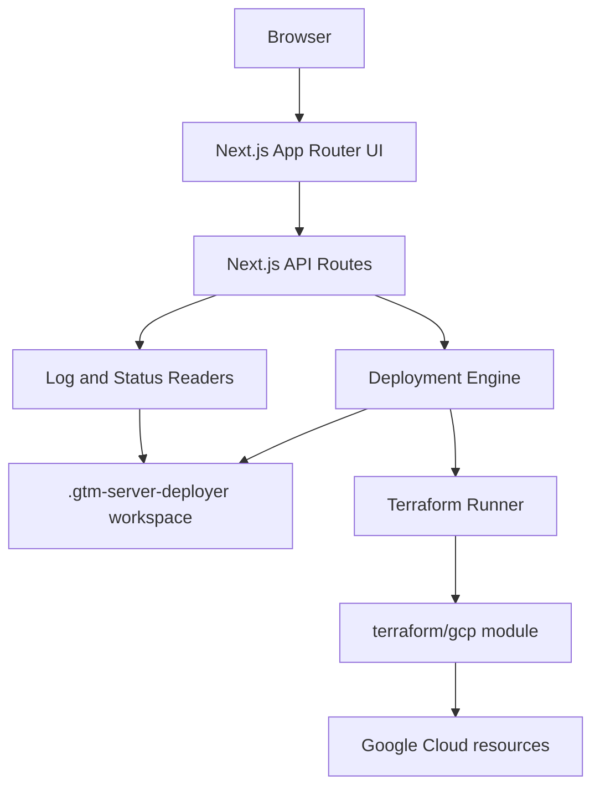

# gtm-server-deployer Design

Date: 2026-07-02
Status: Approved for implementation planning

## Summary

`gtm-server-deployer` is an open-source, local-first web application that deploys Google Tag Manager Server-Side tagging infrastructure to Google Cloud Platform through Terraform. The first implementation is a GCP-focused MVP with a modern Next.js interface, local Terraform execution, live deployment logs, output discovery, and a safe destroy flow.

The MVP demonstrates cloud architecture, Infrastructure as Code, Terraform automation, Docker-based GTM server deployment, Google Cloud Run, managed HTTPS, and production-grade deployment ergonomics without becoming a SaaS product.

## Goals

- Deploy a GTM Server Container to Cloud Run.
- Deploy a Preview Server to Cloud Run by default, with an option to disable it.
- Collect the GTM server container configuration from the user and store it in Secret Manager.
- Configure required GCP services, service accounts, IAM bindings, logging-ready labels, and Terraform outputs.
- Use trusted Cloud Run `*.run.app` HTTPS URLs by default.
- Optionally configure a custom domain with HTTPS load balancing, Certificate Manager managed certificates, and Cloud DNS records.
- Generate Terraform variables, run Terraform locally, stream logs, display status, show outputs, and destroy infrastructure from the UI.
- Reserve AWS, Azure, and generic Terraform folders as documented future-provider placeholders.

## Non-Goals

- Authentication, multi-user support, billing, subscriptions, SaaS backend behavior, or a database.
- Fully working AWS, Azure, or generic provider implementations in the first MVP.
- Production use of self-signed certificates.
- Remote Terraform state or cloud-hosted deployment orchestration.

## Key Decisions

| Area | Decision |
| --- | --- |
| MVP scope | Local Next.js app plus functional GCP deployment only |
| Architecture | Next.js all-in-one local control plane using App Router and API routes |
| Execution | Run installed local `gcloud`, Docker, and Terraform tools |
| Workspace | Store generated local artifacts under `.gtm-server-deployer/` |
| Deployment count | Support one active local deployment at a time |
| Apply safety | Run `terraform plan` first; require Confirm Apply before `terraform apply` |
| GTM config | User pastes GTM server container config; app stores it in Secret Manager |
| Preview server | Enabled by default, with an option to disable |
| HTTPS default | Use Cloud Run HTTPS URLs by default |
| Custom domain | Optional HTTPS load balancer, managed certificate, and Cloud DNS path |
| Multi-cloud | Include provider placeholders, but implement only GCP in the MVP |

## Architecture



The frontend and backend live in one Next.js application. UI pages submit validated deployment settings to API routes. API routes delegate to a TypeScript deployment engine that owns validation, local state, Terraform command sequencing, log capture, output parsing, and error normalization.

The Terraform module remains separate from the web app so it can be understood and tested independently. Provider stubs for AWS, Azure, and generic Terraform document future intent without adding incomplete behavior to the MVP.

## Repository Structure

```text
app/
  api/
  deploy/
  status/
  settings/
components/
  deployment/
  layout/
  providers/
  terraform-console/
lib/
  deployment/
  schemas/
  settings/
  terraform/
terraform/
  gcp/
  aws/
  azure/
  generic/
docker/
scripts/
public/
docs/superpowers/specs/
```

`.gtm-server-deployer/` is a generated local workspace and must be ignored by git. It stores deployment metadata, generated variable files, Terraform working directories, logs, plan files, and output snapshots.

## User Experience

### Home

The landing page introduces the project, describes the local-first deployment model, links to GitHub and documentation, shows provider cards, and includes a roadmap section for future-provider links. GCP is marked available. AWS, Azure, and generic Terraform are marked planned or template-only.

### Deploy Wizard

The wizard has these steps:

1. Cloud Provider: GCP enabled; AWS, Azure, and generic options visible but not deployable in MVP.
2. Project Configuration: project ID, region defaulting to `asia-southeast1`, and environment.
3. Container Configuration: official GTM server container image defaulting to `gcr.io/cloud-tagging-10302018/gtm-cloud-image:stable`, CPU, memory, min instances, max instances, and pasted GTM container config.
4. Preview Server: enabled by default, with optional disable control and optional domain-related preview settings.
5. Networking: HTTPS enabled by default through Cloud Run URLs; optional custom domain, managed SSL, and Cloud DNS.
6. Review and Plan: summary, estimated resource list, generated settings preview with secrets redacted, and Terraform plan execution.
7. Confirm Apply: enabled only after a successful plan; runs Terraform apply and navigates to Status.

### Status

Status shows the active phase, deployment duration, current resources, Terraform console logs, outputs, server URL, preview URL, optional HTTPS URL, warnings, errors, and a guarded Destroy button.

### Settings

Settings store local defaults for Terraform path, Docker path, and gcloud path. Defaults assume binaries are on `PATH`, but advanced users can override paths.

## Backend API Design

The MVP uses route handlers backed by a shared deployment engine:

| Route | Purpose |
| --- | --- |
| `POST /api/deploy/plan` | Validate input, prepare workspace, generate tfvars, run `terraform init`, and run `terraform plan` |
| `POST /api/deploy/apply` | Apply the latest successful plan after explicit user confirmation |
| `POST /api/destroy` | Run `terraform destroy` for the active deployment |
| `GET /api/status` | Return current deployment phase, timestamps, resource summary, and operation state |
| `GET /api/logs` | Return Terraform logs with sensitive values redacted |
| `GET /api/output` | Return parsed Terraform outputs from the active deployment |

The engine rejects concurrent deploy, apply, and destroy operations. It records operation state transitions so the UI can recover after refresh.

## Deployment Engine Flow

```text
Validate wizard input
  -> ensure no conflicting active operation
  -> create or update .gtm-server-deployer/
  -> write redacted metadata and generated terraform.tfvars.json
  -> terraform init
  -> terraform plan
  -> wait for Confirm Apply
  -> terraform apply
  -> terraform output -json
  -> persist outputs and display URLs
```

Destroy follows the same state and logging model:

```text
Confirm destroy
  -> ensure no active operation
  -> terraform destroy
  -> persist destroy result
  -> clear active deployment metadata while retaining logs
```

## Local State Model

The generated workspace contains:

| Path | Purpose |
| --- | --- |
| `.gtm-server-deployer/state.json` | Active deployment metadata and current phase |
| `.gtm-server-deployer/settings.json` | Local binary path preferences |
| `.gtm-server-deployer/terraform.tfvars.json` | Generated Terraform variables, including sensitive input |
| `.gtm-server-deployer/logs/deployment.log` | Append-only Terraform and engine logs with redaction at read time |
| `.gtm-server-deployer/outputs.json` | Last successful `terraform output -json` result |
| `.gtm-server-deployer/workdir/gcp/` | Terraform working directory for the GCP module |

Secrets must never be printed to terminal logs, API responses, or the UI. Local files containing secrets remain inside the ignored workspace.

## GCP Terraform Design

`terraform/gcp` exposes `main.tf`, `variables.tf`, `outputs.tf`, `versions.tf`, and `README.md`.

Core resources:

- Required Google APIs using `google_project_service`.
- Secret Manager secret and secret version for the GTM container config.
- Service account for Cloud Run workloads.
- Least-privilege IAM bindings required by the deployed services.
- Cloud Run service for the GTM server container.
- Cloud Run service for the Preview Server when enabled.
- Labels for project, environment, component, and managed-by metadata.
- Outputs for server URL, preview URL, Cloud Run service names, region, optional load balancer IP, optional HTTPS URL, and certificate status.

Container behavior:

- Server service uses the official GTM image and reads container configuration from Secret Manager.
- Preview service uses the same image with preview mode enabled.
- When preview is enabled, the server service receives the preview URL required for GTM preview behavior.

Optional custom domain path:

- Serverless NEG targeting the server Cloud Run service.
- HTTPS load balancer components: backend service, URL map, target HTTPS proxy, global forwarding rule, and managed certificate.
- Certificate Manager managed certificate for the provided domain.
- Optional Cloud DNS managed zone records when the user enables Cloud DNS automation.

Cloud Run URLs remain the default path because they provide trusted HTTPS without domain ownership.

## Error Handling

Errors are normalized into structured responses with phase, category, message, remediation, and log excerpt.

Handled categories:

- Missing Terraform, gcloud, or Docker binaries.
- gcloud not authenticated or wrong active project.
- Invalid project ID, region, domain, or scaling values.
- Required GCP APIs unavailable or not enabled.
- Permission denied for IAM, Cloud Run, Secret Manager, Certificate Manager, DNS, or load balancing resources.
- Quota exceeded.
- Terraform init, validation, plan, apply, output, or destroy failures.
- Docker or container image resolution failures.
- Cloud Run startup failure.
- DNS propagation delay.
- Managed certificate provisioning delay.

The UI shows actionable remediation instead of generic failure text.

## Security Considerations

- Treat the GTM container config as sensitive.
- Redact sensitive values from logs, summaries, status responses, and output displays.
- Do not commit `.gtm-server-deployer/`.
- Prefer Secret Manager over plain Cloud Run environment variables for persisted secret storage.
- Avoid broad catch-all success fallbacks; failed operations remain failed until the user retries or destroys.
- Require explicit confirmation for apply and destroy.
- Use minimal IAM roles needed for the deployed runtime.

## Testing Strategy

Application tests:

- Zod schema validation for wizard inputs.
- tfvars generation with secret redaction checks.
- deployment state transition tests.
- Terraform command sequencing tests using mocked child processes.
- API route tests for plan, apply, destroy, status, logs, and outputs.
- UI tests for wizard validation, plan gating, status rendering, and destroy confirmation.

Terraform validation:

- `terraform fmt -check` for `terraform/gcp`.
- `terraform validate` with representative variables.
- Static checks for required outputs and variable descriptions.

End-to-end cloud deployment is documented as a manual validation path because it requires authenticated GCP credentials, quota, and real cloud resources.

## Documentation Requirements

`README.md` will include:

- Project overview and portfolio positioning.
- Feature list.
- Mermaid architecture diagram.
- Tech stack.
- Local requirements: Node.js, Terraform, Docker, Google Cloud CLI, optional AWS CLI and Azure CLI.
- Installation and local development steps.
- GCP deployment walkthrough.
- Destroy flow.
- Screenshot placeholders.
- Roadmap.
- Contribution guide.
- Apache 2.0 license notice.
- Prominent one-click deployment sections:
  - Google Cloud: MVP local deployment, with Cloud Shell launch button planned.
  - Azure: planned deployment button backed by future Azure entry point.
  - AWS: planned launch stack button backed by future AWS bootstrap.
  - Generic Terraform: planned downloadable provider template.

## Future Work

- Working AWS implementation.
- Working Azure implementation.
- Generic Terraform provider template export.
- Google Cloud Shell launch button.
- Multi-region deployment.
- GitHub Actions CI/CD.
- Drift detection.
- Cost estimation.
- AI deployment assistant.
- Auto-scaling recommendations.
- Infrastructure visualization.
- Policy validation.
- Secret rotation.

## Implementation Boundary

This design is complete enough for a single implementation plan focused on the GCP MVP. Future providers are documented but intentionally not implemented in this cycle.
